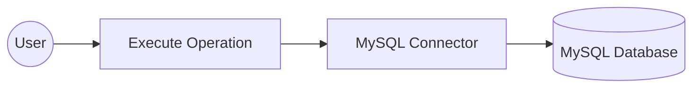

# Example

Build a WSO2 Integrator automation that connects to a MySQL database using configurable connection parameters and executes an INSERT SQL statement. The integration uses the MySQL connector to insert a record into a database table safely, without hardcoding credentials in source code.

**Operations used:**

- **Execute**: Runs a parameterized SQL INSERT statement against the connected MySQL database and returns an execution result.

## Architecture

:::info Prerequisites
- A running MySQL database instance with a table to insert records into.
- MySQL database credentials (host, user, password, database name, and port).
:::

## Set up the MySQL integration

:::tip New to WSO2 Integrator?
Follow the [Create a new integration](../../../../develop/create-integrations/create-a-new-integration.md) guide to set up your integration first, then return here to add the connector.
:::

## Add the MySQL connector

### Open the connector palette and select the MySQL connector

1. On the canvas, click **+ Add Connection** to open the connector palette.
2. In the palette search box, enter **MySQL**.
3. Select the **MySQL** card to open the **Configure MySQL** form.

## Configure the MySQL connection

### Fill in the MySQL connection parameters

In the **Configure MySQL** form, expand **Advanced Configurations** to reveal all connection fields. Use the **Configurables** tab in the helper panel to bind each field to a configurable variable, keeping credentials out of source code. For each parameter listed below:

1. Open the helper panel beside the field and go to the **Configurables** tab.
2. Select an existing configurable or click **+ New Configurable**.
3. Supply a camelCase name and the appropriate type, then click **Save**. The configurable is injected into the field.

- **host**: MySQL server hostname, bound to a `string` configurable named `mysqlHost`.
- **user**: Database username, bound to a `string?` configurable named `mysqlUser`.
- **password**: Database user password, bound to a `string?` configurable named `mysqlPassword`.
- **database**: Database name to connect to, bound to a `string?` configurable named `mysqlDatabase`.
- **port**: MySQL server port, bound to an `int` configurable named `mysqlPort`.

After creating all five configurables, set **Connection Name** to `mysqlClient`.

### Save the MySQL connection

Select **Save Connection** to save the connector. The canvas returns to the integration overview and `mysqlClient` is now visible under **Connections** in the left-hand project tree.

### Set actual values for your configurables

1. In the left panel, click **Configurations**.
2. Set a value for each configurable listed below.

- **mysqlHost**: Hostname or IP address of your MySQL server (`string`).
- **mysqlUser**: Database username (`string?`).
- **mysqlPassword**: Database user password (`string?`).
- **mysqlDatabase**: Name of the database to connect to (`string?`).
- **mysqlPort**: Port number your MySQL server listens on (`int`).

## Configure the MySQL execute operation

### Add an automation entry point

1. Click **+ Add Artifact** on the canvas toolbar.
2. Under **Automation**, select the **Automation** tile.
3. Click **Create**. No additional configuration is needed.

The automation flow canvas opens, showing a **Start** node and an **Error Handler** node with an empty step slot between them.

Select the empty step placeholder in the flow to open the step addition panel. In the right-hand panel, locate the **Connections** section, select **mysqlClient** to expand its available operations, and then select **Execute**.

### Configure the execute operation parameters and save

Fill in the operation fields, then select **Save** to add the step to the automation flow.

- **sqlQuery**: A parameterized SQL INSERT statement to execute. Use backtick-templated parameters so values are bound safely (no string concatenation). For example: `` `INSERT INTO users (name, email) VALUES (${name}, ${email})` ``, where `name` and `email` are Ballerina variables (for example, bound to inputs of the automation).
- **result**: Variable that holds the returned `sql:ExecutionResult`. Pre-filled as `sqlExecutionresult`.

The automation flow now contains a single execute step between **Start** and **Error Handler**.

## Try it yourself

Try this sample in WSO2 Integration Platform.

[View source on GitHub](https://github.com/wso2/integration-samples/tree/main/integrator-default-profile/connectors/mysql_connector_sample)
