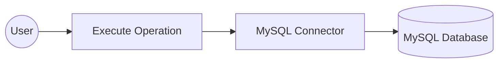

# Example

## What you'll build

Build a WSO2 Integrator automation that connects to a MySQL database using configurable connection parameters and executes an INSERT SQL statement. The integration uses the MySQL connector to insert a record into a database table safely, without hardcoding credentials in source code.

**Operations used:**
- **Execute** — runs a parameterized SQL INSERT statement against the connected MySQL database and returns an execution result

## Architecture

## Prerequisites

- A running MySQL database instance with a table to insert records into
- MySQL database credentials (host, user, password, database name, and port)

## Setting up the MySQL integration

> **New to WSO2 Integrator?** Follow the [Create a New Integration](../../../../develop/create-integrations/create-a-new-integration.md) guide to set up your integration first, then return here to add the connector.

## Adding the MySQL connector

### Step 1: Open the connector palette and select the MySQL connector

1. On the canvas, click **+ Add Connection** to open the connector palette.
2. In the palette search box, enter **MySQL**.
3. Select the **MySQL** card to open the **Configure MySQL** form.

## Configuring the MySQL connection

### Step 2: Fill in the MySQL connection parameters

In the **Configure MySQL** form, expand **Advanced Configurations** to reveal all connection fields. Use the **Configurables** tab in the helper panel to bind each field to a configurable variable, keeping credentials out of source code. For each parameter listed below:

1. Open the helper panel beside the field and go to the **Configurables** tab.
2. Select an existing configurable or click **+ New Configurable**.
3. Supply a camelCase name and the appropriate type, then click **Save**. The configurable is injected into the field.

- **host** (string) : MySQL server hostname
- **user** (string) : database username
- **password** (string) : database user password
- **database** (string) : name of the database to connect to
- **port** (int) : MySQL server port

After creating all five configurables, set **Connection Name** to `mysqlClient`.

### Step 3: Save the MySQL connection

Click **Save Connection** to save the connector. The canvas returns to the integration overview and `mysqlClient` is now visible under **Connections** in the left-hand project tree.

### Step 4: Set actual values for your configurables

1. In the left panel, click **Configurations**.
2. Set a value for each configurable listed below.

- **mysqlHost** (string) : hostname or IP address of your MySQL server
- **mysqlUser** (string) : database username
- **mysqlPassword** (string) : database user password
- **mysqlDatabase** (string) : name of the database to connect to
- **mysqlPort** (int) : port number your MySQL server listens on

## Configuring the MySQL execute operation

### Step 5: Add an automation entry point

1. Click **+ Add Artifact** on the canvas toolbar.
2. Under **Automation**, select the **Automation** tile.
3. Click **Create**. No additional configuration is needed.

The automation flow canvas opens, showing a **Start** node and an **Error Handler** node with an empty step slot between them.

### Step 6: Select the execute operation and configure its parameters

1. Click the empty step placeholder in the flow to open the step-addition panel.
2. In the right-hand panel, expand **Connections → mysqlClient** to reveal its available operations.

3. Click **Execute** to open its configuration form, then fill in the operation fields.

- **sqlQuery** — parameterized SQL INSERT statement to execute against the database (for example, `INSERT INTO users (name, email) VALUES ("John Doe", "john@example.com")`)
- **result** — variable that holds the returned `sql:ExecutionResult`; pre-filled as `sqlExecutionresult`

4. Click **Save** to add the step to the automation flow.

## Try it yourself

Try this sample in WSO2 Integration Platform.

[View source on GitHub](https://github.com/wso2/integration-samples/tree/main/integrator-default-profile/connectors/mysql_connector_sample)
