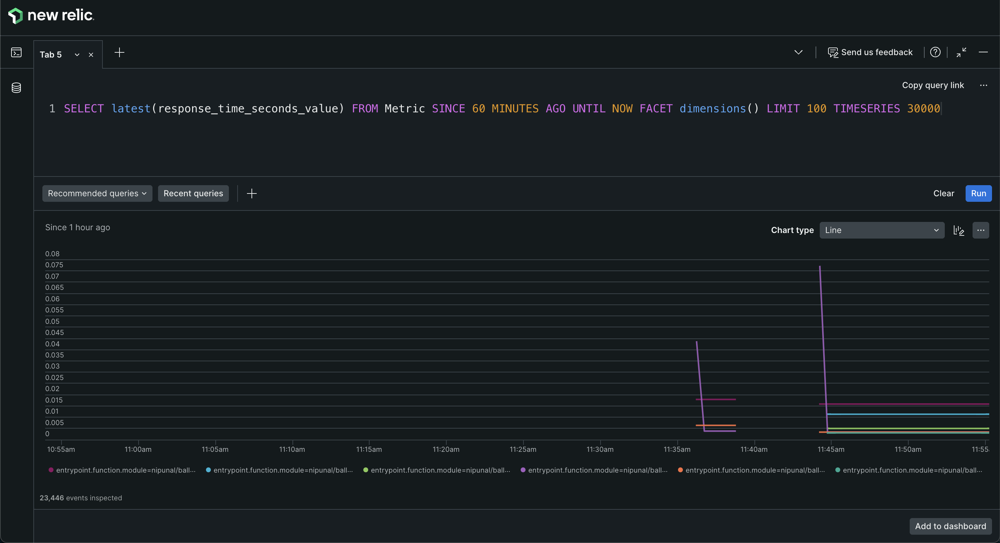
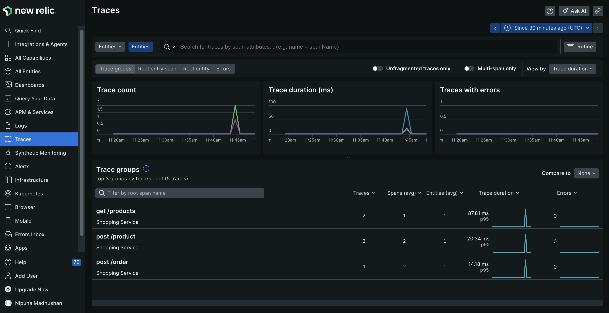
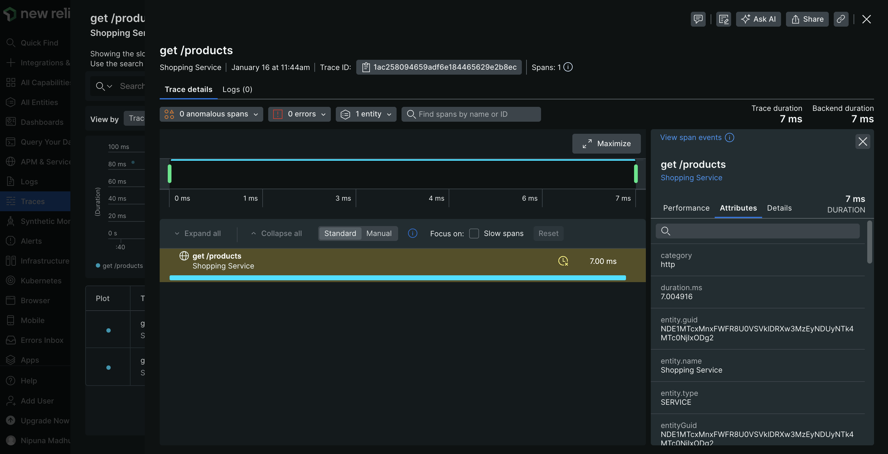

# Observe metrics and tracing using New Relic

[New Relic](https://newrelic.com/) is an observability platform designed to help organizations monitor, analyze, and
troubleshoot their applications, infrastructure, and digital experiences in real-time. Both metrics and tracing of an integration can
be viewed with New Relic.

The sample shop service will be used in this guide. Follow the steps given below to observe tracing and metrics in New Relic.

## Step 1 - Create a New Relic account and an API key

Sign up and Generate an API Key in New Relic.

To configure the API key in New Relic:
> Go to **Profile → API keys → Insights Insert key → Insert keys** to create an account in New Relic.

## Step 2 - Import Ballerina New Relic extension

To include the New Relic extension into the executable, the `ballerinax/newrelic` module needs to be imported into your
integration `main.bal` file. Navigate to File explorer view in WSO2 Integrator to do so.

```ballerina
import ballerinax/newrelic as _;
```

New Relic extension has an `Opentelemetry GRPC Span Exporter` which will push tracing data as batches to the New Relic server endpoint (`https://otlp.nr-data.net:4317`) in opentelemetry format.

New Relic extension pushes metrics in New Relic metric format to the New Relic server endpoint (`https://metric-api.newrelic.com/metric/v1`).

## Step 3 - Configure runtime configurations

Add the below to `Ballerina.toml` file.

```toml
[build-options]
remoteManagement = true
```

Tracing and metrics can be enabled in your Ballerina project using configurations similar to the following in your `Config.toml` file.

**File path:** `Config.toml`

```toml
[ballerina.observe]
tracingEnabled=true
tracingProvider="newrelic"
metricsEnabled=true
metricsReporter="newrelic"

[ballerinax.newrelic]
apiKey="<NEW_RELIC_LICENSE_KEY>"    # Mandatory Configuration.
tracingSamplerType="const"          # Optional Configuration. Default value is 'const'
tracingSamplerParam=1               # Optional Configuration. Default value is 1
tracingReporterFlushInterval=15000  # Optional Configuration. Default value is 15000 milliseconds
tracingReporterBufferSize=10000     # Optional Configuration. Default value is 10000
metricReporterFlushInterval=15000   # Optional Configuration. Default value is 15000 milliseconds
metricReporterClientTimeout=10000   # Optional Configuration. Default value is 10000 milliseconds
isTraceLoggingEnabled=false         # Optional Configuration. Default value is false
isPayloadLoggingEnabled=false       # Optional Configuration. Default value is false

[ballerinax.newrelic.additionalAttributes]      # Optional Configuration. Add custom attributes (key & value pair) to metrics
key1 = "<VALUE_1>"
key2 = "<VALUE_2>"
```

Users can also configure multiple API keys for different New Relic user accounts as given below.

```toml
[ballerinax.newrelic]
apiKey=["<NEW_RELIC_LICENSE_KEY_1>", "<NEW_RELIC_LICENSE_KEY_2>"]
```

:::tip
User can configure the environment variable `BALLERINA_NEW_RELIC_API_KEY` instead of apiKey in `Config.toml`. If both are configured, apiKey in `Config.toml` will be overwritten by the environment variable value.

Environment variable can be configured for either a single user or multiple users.

**For a single user account:**
- Linux/Unix: `export BALLERINA_NEW_RELIC_API_KEY="<NEW_RELIC_LICENSE_KEY>"`
- Windows: `set BALLERINA_NEW_RELIC_API_KEY="<NEW_RELIC_LICENSE_KEY>"`

**For multiple user accounts:**
- Linux/Unix: `export BALLERINA_NEW_RELIC_API_KEY="<NEW_RELIC_LICENSE_KEY_1>,<NEW_RELIC_LICENSE_KEY_2>"`
- Windows: `set BALLERINA_NEW_RELIC_API_KEY="<NEW_RELIC_LICENSE_KEY_1>,<NEW_RELIC_LICENSE_KEY_2>"`

**Note:** When specifying multiple API keys in the environment variable, separate each key with a comma (`,`) and do not include spaces between the keys. Any leading or trailing whitespace around each key will be trimmed automatically. For example:
- `export BALLERINA_NEW_RELIC_API_KEY="key1,key2,key3"`
- `export BALLERINA_NEW_RELIC_API_KEY="key1, key2 , key3"` (spaces will be trimmed)
:::

### Configuration options

| Configuration key | Description | Default value | Possible values |
| --- | --- | --- | --- |
| `ballerinax.newrelic.apiKey` | API key generated by the user in the New Relic platform. **This configuration is mandatory.** | `None` | |
| `ballerinax.newrelic.tracingSamplerType` | Type of the sampling methods used in the New Relic tracer. | `const` | `const`, `probabilistic`, or `ratelimiting` |
| `ballerinax.newrelic.tracingSamplerParam` | It is a floating value. Based on the sampler type, the effect of the sampler param varies | `1.0` | For `const` `0` (no sampling) or `1` (sample all spans), for `probabilistic` `0.0` to `1.0`, for `ratelimiting` any positive integer (rate per second) |
| `ballerinax.newrelic.tracingReporterFlushInterval` | The New Relic tracing client will be sending the spans to the agent at this interval. | `15000` | Any positive integer value |
| `ballerinax.newrelic.tracingReporterBufferSize` | Queue size of the New Relic tracing client. | `10000` | Any positive integer value |
| `ballerinax.newrelic.metricReporterFlushInterval` | The New Relic client will be sending the metrics to the agent at this interval. | `15000` | Any positive integer value |
| `ballerinax.newrelic.metricReporterClientTimeout` | Queue size of the New Relic metric client. | `10000` | Any positive integer value |


## Step 4 - Send requests

Run the service and send requests.

Example cURL commands:

```bash
$ curl -X GET http://localhost:8090/shop/products
```

```bash
$ curl -X POST http://localhost:8090/shop/product \
-H "Content-Type: application/json" \
-d '{
    "id": 4, 
    "name": "Laptop Charger", 
    "price": 50.00
}'
```

```bash
$ curl -X POST http://localhost:8090/shop/order \
-H "Content-Type: application/json" \
-d '{
    "productId": 1, 
    "quantity": 1
}'
```

```bash
$ curl -X GET http://localhost:8090/shop/order/0
```

## Step 5 - View metrics on the New Relic platform

You can view the metrics that were published to the New Relic platform in the New Relic query builder. You can view the metrics query data in graphical format, as shown below.



You can create a dashboard from the metrics provided by Ballerina in the New Relic platform.

## Step 6 - View tracing on the New Relic platform

You can view the traces that were published to the New Relic platform in New Relic traces.





## What's next

- [Jaeger](jaeger-distributed-tracing.md) — Alternative distributed tracing with Jaeger
- [Zipkin](zipkin-tracing.md) — Alternative distributed tracing with Zipkin
- [Observability Overview](observability-overview.md) — Full observability architecture
