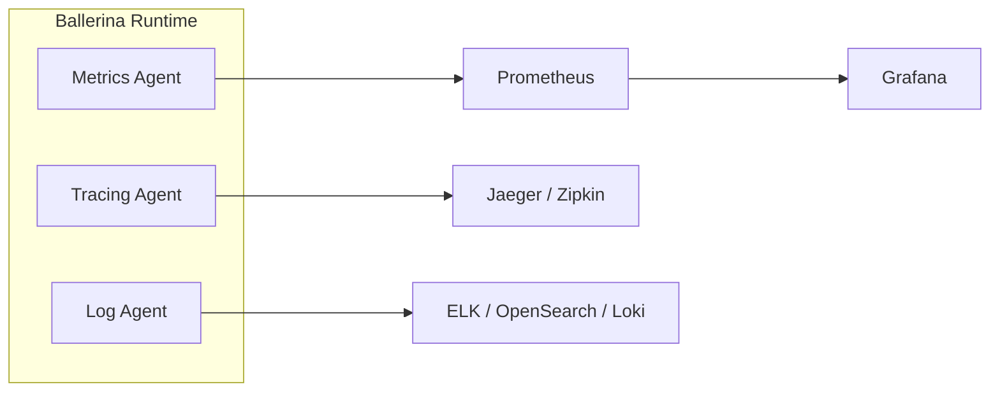

# Observability Overview

Observability is essential for understanding the behavior, performance, and health of your integrations in production. WSO2 Integrator provides built-in support for the three pillars of observability: metrics, logging, and distributed tracing. Choose from WSO2-managed solutions, self-managed open-source stacks, or commercial platforms based on your deployment model and requirements.

## The Three Pillars of Observability

| Pillar | Purpose | Key Metrics | Built-in Support |
|--------|---------|-------------|-----------------|
| **Metrics** | Quantitative measurements of system behavior | Request counts, latency, error rates, throughput | Prometheus-compatible endpoint |
| **Logging** | Structured event records for debugging and auditing | Log entries with context, error details, request tracing | Ballerina `log` module with configurable levels |
| **Distributed Tracing** | End-to-end request flow across services | Span duration, service dependencies, bottlenecks | OpenTelemetry-based tracing |

## Architecture

## WSO2 Provided Solutions

WSO2 provides fully managed observability solutions for integrations deployed on the WSO2 platform.

| Solution | Best For | Features | Setup Complexity |
|----------|----------|----------|------------------|
| **[Integration Control Plane (ICP)](integration-control-plane-icp.md)** | On-premise & hybrid deployments | Service inventory, real-time monitoring, log aggregation, deployment tracking | Low |
| **[WSO2 Integration Platform](observability-devant.md)** | Cloud-native integrations | Built-in dashboards, alerting, live logs, distributed tracing, diagnostics | Very Low |
| **[Moesif](moesif-api-analytics.md)** | API analytics & monitoring | API usage tracking, request/response inspection, usage-based billing, alerting | Very Low |

### When to choose WSO2 solutions:
- You want zero or minimal setup for observability
- You need built-in integration with WSO2 platform
- You require compliance with WSO2 enterprise support
- For API analytics (Moesif), you need deep insight into API usage patterns and customer behavior

---

## Self-Managed Solutions (Open Source)

Deploy and manage your own observability stack. Ideal for organizations with existing infrastructure investments or specific compliance requirements.

### Metrics (Prometheus + Grafana)
- **[Metrics Overview](metrics-overview.md)** – Enable and configure Prometheus metrics
- **[Prometheus Setup](prometheus-metrics.md)** – Detailed Prometheus configuration
- **[Grafana Dashboards](grafana-dashboards.md)** – Create custom visualization dashboards
- **[Custom Metrics](custom-metrics.md)** – Define business and application metrics

**When to use:** Open-source, self-hosted metrics collection with rich visualization capabilities.

### Logging (ELK or OpenSearch)
- **[Logging Overview](logging-overview.md)** – Configure structured logging and log aggregation approaches
- **[Elastic Stack (ELK)](elastic-stack-elk.md)** – Elasticsearch, Logstash, Kibana setup
- **[OpenSearch Integration](opensearch-integration.md)** – Open-source Elasticsearch alternative

**When to use:** Full-text log search, complex log processing, multi-service log correlation.

### Distributed Tracing (Jaeger or Zipkin)
- **[Distributed Tracing Overview](distributed-tracing-overview.md)** – Configure trace exporters and sampling
- **[Jaeger Setup](jaeger-distributed-tracing.md)** – Production-grade distributed tracing
- **[Zipkin Setup](zipkin-tracing.md)** – Lightweight distributed tracing alternative

**When to use:** Trace requests across service boundaries, identify latency bottlenecks, debug request failures.

### Comparison Matrix

| Stack | Metrics | Logging | Tracing | Complexity | Cost |
|-------|---------|---------|---------|------------|------|
| **Prometheus + Grafana** | ✅ Native | Via Loki | Via Tempo | Medium | Free |
| **ELK Stack** | Via Metricbeat | ✅ Native | Via APM | High | Free |
| **OpenSearch** | Via collector | ✅ Native | Via Data Prepper | High | Free |
| **Jaeger Only** | -- | -- | ✅ Native | Low | Free |
| **Zipkin Only** | -- | -- | ✅ Native | Low | Free |

---

## Commercial Managed Solutions

Deploy your integration on managed cloud platforms with built-in observability. Lower operational overhead, SLA guarantees, and dedicated support.

| Platform | Best For | Metrics | Logging | Tracing | Setup |
|----------|----------|---------|---------|---------|-------|
| **[Datadog](datadog-integration.md)** | Enterprise full-stack | ✅ Via Agent | ✅ Via Agent | ✅ Via APM | Low |
| **[New Relic](new-relic-integration.md)** | Multi-cloud environments | ✅ Via OTLP | ✅ Via forwarder | ✅ Via OTLP | Low |

### Integration Approaches

**1. Direct Integration** – Use Ballerina's built-in observability extensions
- Ballerina Prometheus extension → Prometheus
- Ballerina Jaeger extension → Jaeger / Zipkin

**2. OpenTelemetry Collector** – Vendor-neutral pipeline for commercial platforms
- Ballerina → OpenTelemetry Collector → Datadog / New Relic / Splunk

**3. Agent Pattern** – Sidecar agents for automatic collection
- Datadog Agent, New Relic Agent, Elastic APM Agent

See **[Third-Party Observability Tools](third-party-overview.md)** for detailed comparison and setup guides.

---

## Recipes: End-to-End Solutions

Choose a recipe based on your deployment scenario and infrastructure.

### Recipe 1: Local Development Stack
**Tech Stack:** Docker Compose + Prometheus + Grafana + Jaeger + Loki

Perfect for development, testing, and small-scale deployments.

- Set up metrics collection with Prometheus
- Visualize with Grafana dashboards
- Trace requests with Jaeger
- Aggregate logs with Loki

**[View Recipe](recipe-local-development.md)**

### Recipe 2: Kubernetes Production Stack
**Tech Stack:** Kubernetes + Prometheus Operator + Grafana + Jaeger Operator

Enterprise-grade Kubernetes observability with auto-discovery and scale.

- Deploy Prometheus Operator for automatic metric scraping
- Create managed Grafana dashboards
- Deploy Jaeger Operator for distributed tracing
- Enable OpenTelemetry for trace collection

**[View Recipe](recipe-kubernetes-production.md)**

### Recipe 3: ELK Stack (Logs + Analytics)
**Tech Stack:** Elasticsearch + Logstash/Filebeat + Kibana + Jaeger

Complete log aggregation, full-text search, and distributed tracing.

- Ship logs from integrations to Elasticsearch
- Build Kibana dashboards for log analysis
- Query logs by service, trace ID, or error type
- Correlate logs with traces

**[View Recipe](recipe-elk-stack.md)**

### Recipe 4: Datadog Full-Stack Observability
**Tech Stack:** Datadog Agent + Datadog Cloud

Managed cloud observability with minimal setup.

- Install Datadog Agent as sidecar
- Automatic metric, log, and trace collection
- Datadog dashboards and monitors
- Native APM and service maps

**[View Recipe](recipe-datadog-setup.md)**

### Recipe 5: OpenSearch Log Analytics
**Tech Stack:** OpenSearch + Fluent Bit + OpenSearch Dashboards

Open-source alternative to ELK with modern features.

- Deploy OpenSearch cluster
- Ship logs with Fluent Bit or Data Prepper
- Build visualizations in OpenSearch Dashboards
- Trace analytics with Data Prepper

**[View Recipe](recipe-opensearch-setup.md)**

---

## Quick Reference: Choosing Your Solution

**Are you using WSO2 cloud platform?**
→ Use **[WSO2 Integration Platform](observability-devant.md)** (zero setup required)

**Do you run integrations on-premise with WSO2 Integrator?**
→ Use **[Integration Control Plane (ICP)](integration-control-plane-icp.md)** (centralized dashboard)

**Do you want self-hosted, open-source solutions?**
→ Choose based on your needs:
- Metrics only → **[Prometheus + Grafana](metrics-overview.md)**
- Logs + search → **[ELK Stack](elastic-stack-elk.md)** or **[OpenSearch](opensearch-integration.md)**
- Tracing → **[Jaeger](jaeger-distributed-tracing.md)** or **[Zipkin](zipkin-tracing.md)**
- All three → See **[Recipes](#recipes-end-to-end-solutions)**

**Do you want managed commercial observability?**
→ Choose based on platform:
- **[Datadog](datadog-integration.md)** – Enterprise, AWS-centric
- **[New Relic](new-relic-integration.md)** – Multi-cloud, developer-friendly
- **[Moesif](moesif-api-analytics.md)** – API-specific analytics

**Do you need detailed setup instructions?**
→ See **[Third-Party Observability Tools](third-party-overview.md)** for all integration approaches
