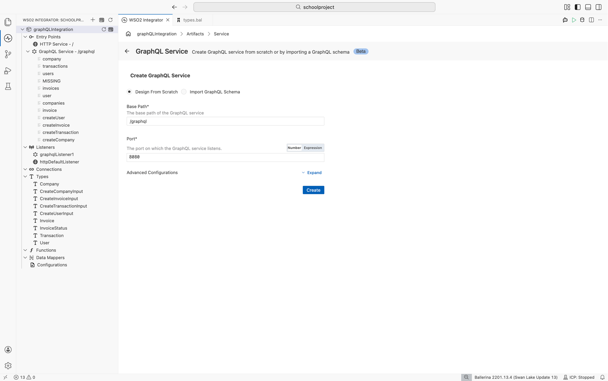
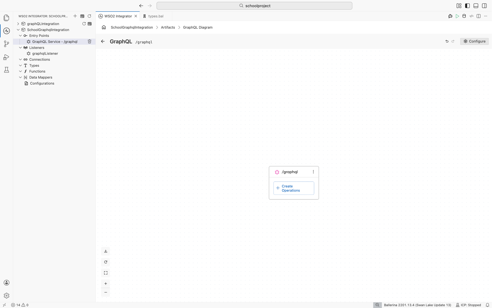
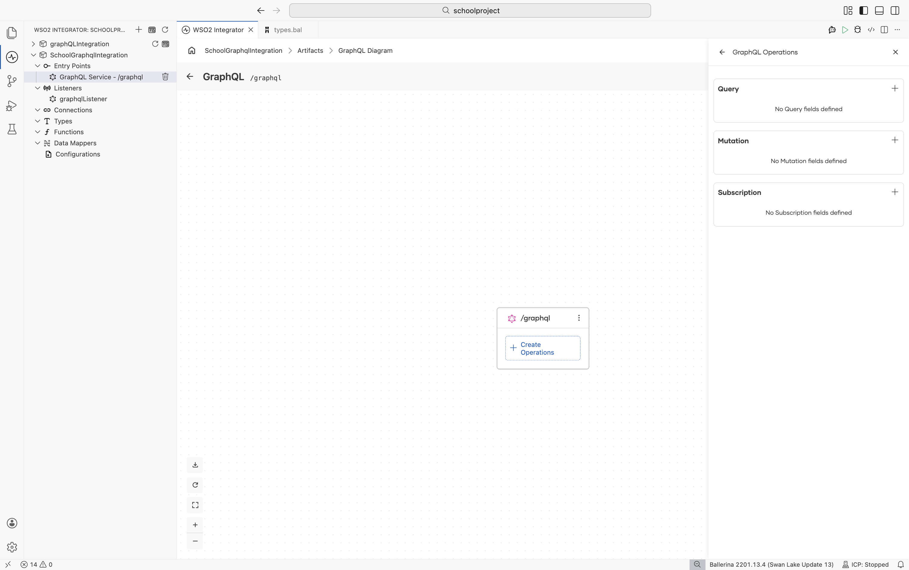
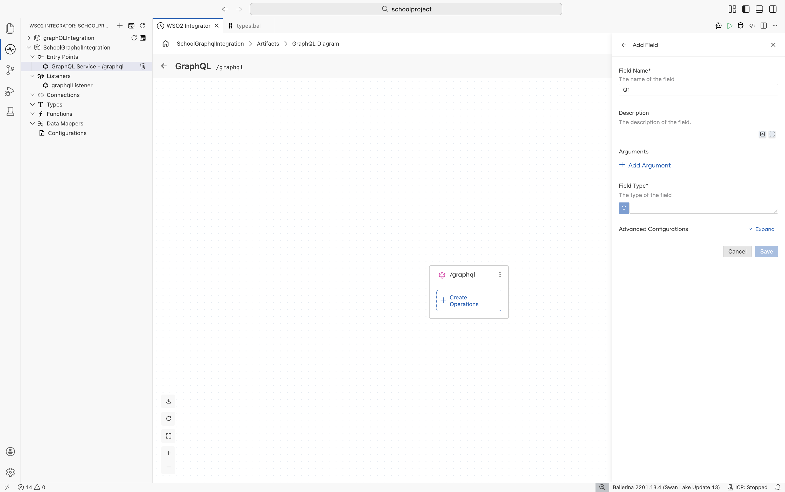
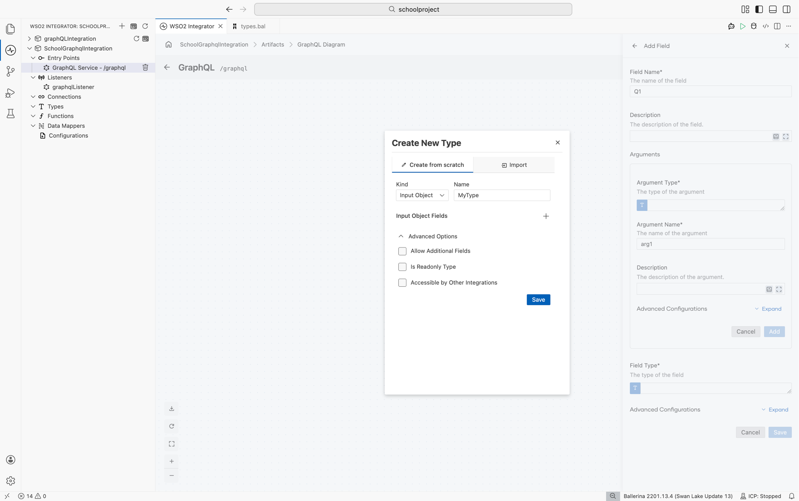

import Tabs from '@theme/Tabs';
import TabItem from '@theme/TabItem';

# GraphQL Service

GraphQL services let you build flexible APIs where clients request exactly the data they need. WSO2 Integrator supports both code-first and schema-first approaches to design a GraphQL service. It also provides a visual canvas to model the schema and implement resolver logic.

:::note Beta
GraphQL service support is currently in beta.
:::

## Creating a GraphQL service

<Tabs>
<TabItem value="ui" label="Visual Designer" default>

You can create a GraphQL service using either a code-first or schema-first approach. THe Code-first approach is useful when you want full control over the schema design directly in the tool and schema-frist approach is useful when you already have a predefined SDL schema.

**Code-first approach**

1. Open the **WSO2 Integrator** sidebar in IDE.
2. Click **+** next to **Entry Points**.
3. Select **GraphQL Service**.
4. Select **Design From Scratch**.
5. Fill in the required fields:

   | Field | Description | Default |
   |---|---|---|
   | **Base Path** | Endpoint path for the service | `/graphql` |
   | **Port** | Listener port | `8080` |

6. Optionally expand **Advanced Configurations** and set the **Listener Name**.
7. Click **Create**.



**Schema-first approach**

1. Open the **WSO2 Integrator** sidebar in IDE.
2. Click **+** next to **Entry Points**.
3. Select **GraphQL Service**.
1. Select **Import GraphQL Schema**.
2. Click **Select File** and choose your SDL schema file.
3. Optionally expand **Advanced Configurations** and set the **Listener Name**.
4. Click **Create**.


</TabItem>
<TabItem value="code" label="Ballerina Code">

```ballerina
import ballerina/graphql;

configurable int port = 8080;

listener graphql:Listener graphqlListener = new (port);

service /graphql on graphqlListener {
    // Add query, mutation, and subscription fields
}
```

</TabItem>
</Tabs>

## GraphQL diagram

After creating the service, WSO2 Integrator opens the **GraphQL diagram** which is an interactive canvas where you can define and organize your GraphQL service. The diagram displays types, fields, and relationships, helps you understand dependencies between types, and allowing you to validate the structure and navigate complex schemas efficiently.



## GraphQL operations

Operations define entry points to your GraphQL API. GraphQL has three root operaion type which has mutiple fields. To add an operation, click **+ Create Operations** on the service card In the GraphQL diagram.

- **Query**: Read data.
- **Mutation**: Modify data.
- **Subscription**: Receive real-time updates.

 // TODO: Replace the screenshot with a service that has operations

## Fields

Each GraphQL operation consists of fields, where each field has a name and a return type, and may also include arguments.

Click the **+** next to an operation type,to open the **Add Field** panel. 

| Field | Description |
|---|---|
| **Field Name** | The name of the field |
| **Description** | Documentation of the field |
| **Arguments** | Input arguments — click **+ Add Argument** to add an argument |
| **Field Type** | The type of the field |

. // Change the screenshot

## Arguments

Fields can accept different type arguments like scalar, list and input object.

Click **+ Add arguments** to open the Argument form.

| Field | Description |
|---|---|
| **Argument Type** | The type of the argument. Click the text area to open the type helper. Input objects or enums can be added using **+ Create New Type**. |
| **Argument Name** | Name of the argument |
| **Description** | Documentation of the argument (optional) |
| **Default Value** | Default value (optional) — expand **Advance Configurations** to add a default value |

Click **Add** to save the argument.

## Types

Type is the fundamental unit of any GraphQL schema. Each field yields a value of a specific type.

1. Click **Field Type** text are to open the type helper.
2. Pre-defined scalar types are listed in the type helper.
2. click **Createt New Type** to add an objcet, enum or union type.



:::note Id type
**ID type** - If a given argument or field type can be made an ID type, a checkbox will be appeared to mark it as an ID type.
:::

:::note subscription return types
**Subscriptions** - When adding a subscription field type, type should be wrapped with `stream` type. (Ex: stream<NewsUpdates, error?>)
:::

## Implement resolver logic

Once fields are added, they appear as rows in the panel under root operation types.

1. Click the pencil icon of a field row (for example, `product` or `createProduct`) to open the **flow designer view**, where you can define the resolver logic using the visual designer.
2. Click **+** icon below the start node to open the **Node palette**, where you can select any node including connections, variables and etc.

// screenshot of node pallete

</TabItem>
<TabItem value="code" label="Ballerina Code">

```ballerina
service /graphql on graphqlListener {

    // Query
    resource function get product(string id) returns Product|error {
        return getProduct(id);
    }

    // Mutation
    remote function createProduct(ProductInput input) returns Product|error {
        return addProduct(input);
    }

    // Subscription
    resource function subscribe onProductCreated() returns stream<Product, error?> {
        return getProductStream();
    }
}
```

</TabItem>
</Tabs>

## Advanced configurations

Advanced configurations allow fine-grained control over service behavior.

## Service configurations

Use the **Configure** button on the GraphQL diagram to open the service configuration view. Select the GraphQL service from the left navigation.

| Field | Description |
|---|---|
| **Service Base Path** | The base endpoint path for the GraphQL service |
| **Service Configuration** | Service-level settings such as maximum query depth. Click the service configuration text area to open up the config panel. |

// screenshot of service config

</TabItem>
<TabItem value="code" label="Ballerina Code">

```ballerina
@graphql:ServiceConfig {
    maxQueryDepth: 7
}
service /graphql on graphqlListener {
    resource function get product(string id) returns Product|error {
        return getProduct(id);
    }
}
```

</TabItem>
</Tabs>

## Listener configurations

The **Configuration for graphqlListener** section on the same panel shows:

| Field | Description |
|---|---|
| **Name** | Name of the attached listener |
| **Listen To** | An `http:Listener` or a port number to listen to the GraphQL service endpoint |
| **Host** | The host name or IP address of the endpoint |

In addition, HTTP configurations are available which used as the underlying transport protocol.

### Field configurations

WSO2 Integrator supports the following GraphQL field configurations.

| Field | Description |
|---|---|
| **Field Configuration** | Field-level settings such as cache configuration |
| **Request Context** | Pass meta-information of a request among GraphQL resolvers |
| **Field Metadata** | Access meta-information of a field in a GraphQL document |

To configure the field configurations,

1. Click on the GraphQL service card in GraphQl diagram to open **GraphqQL Operations** panel.
2. Select the field that needs to be configured.
3. Click pencil icon to open the field form.
4. Expand the **Advanced Configurations** at the bootm of the form.
5. Click on **Field Configuration** text area to open the config panel.

</TabItem>
<TabItem value="code" label="Ballerina Code">

```ballerina
service /graphql on graphqlListener {

    @graphql:CacheConfig {
        cacheConfig: {
            enabled: true
        }
    }
    resource function get product(string id) returns Product|error {
        return getProduct(id);
    }
}
```

</TabItem>
</Tabs>
