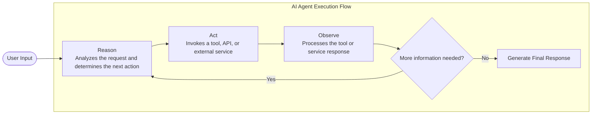

# AI Agents

An AI Agent is an integration component that combines an LLM, a system prompt, tools, memory, and orchestration logic into a single artifact. Once configured, you can interact with the agent using user messages, allowing it to reason about requests, invoke tools, and generate responses.

WSO2 Integrator also provides built-in support for observability, tracing, and evaluation to help monitor, test, and improve agent behavior.

## How an AI agent works

An AI agent operates as a goal-driven loop that continuously interprets input, plans and executes actions, and updates its context based on the results until the desired outcome is achieved. This loop can interact with functions, APIs, connectors, and backend services.



In this flow:

- **Reason** — The LLM evaluates the user input, conversation context, and available tools to determine the next action.
- **Act** — If additional information or an external action is required, the agent invokes a tool, connector, API, or backend service.
- **Observe** — The result of the tool execution is returned to the LLM as additional context.
- **Repeat or Respond** — The agent either continues the reasoning loop or generates the final response once sufficient information is available.

This iterative execution model enables agents to handle dynamic, multi-step workflows grounded in real-world systems and data.

## Components of an AI agent

An AI agent is composed of four core components that enable reasoning, action execution, and context management.

| Component | Description |
|---|---|
| **Model** | The Large Language Model (LLM) responsible for reasoning and response generation |
| **System Prompt** | Instructions that define the agent’s role, behavior, constraints, and interaction style |
| **Tools** | Functions, APIs, connectors, or services that the agent can invoke during execution |
| **Memory** | Context and conversation state maintained across interactions |

Without tools, the agent is limited to generating responses without interacting with external systems. Without memory, the agent cannot maintain context across multi-turn conversations.

## Multi-artifact project view

A real project usually has more than one artifact: an agent for chat, plus an HTTP service for batch operations or RAG queries, plus an MCP service for assistants. The project Overview canvas visualizes all of them at once with the connections each one uses:


Each artifact operates independently. The overview canvas helps visualize how services, providers, and integrations are connected within the project.

The top-right toolbar provides the following actions:

| Action | Description |
|---|---|
| **Configure** | Opens the `Config.toml` editor for updating configurable values such as API keys and endpoints |
| **Run** | Builds and runs the integration |
| **Debug** | Runs the integration with debugger support enabled |

## What an agent looks like in the canvas

Once an agent is created, click on the **AI Agent Service** (see [Multi-Artifact Project View](#multi-artifact-project-view) above) to open the agent canvas.

The agent is represented as a simple integration flow consisting of the following blocks:

- **Start**
- **AI Agent**
- **Return**

The **AI Agent** block provides a centralized configuration interface for defining the agent’s behavior and capabilities.


The **AI Agent** block allows you to configure the following components of the agent:

- **System prompt and agent behavior** — Click the **AI Agent** block to open the configuration panel, where you can configure the agent role, instructions, query input, and response mapping.
- **Memory configuration** — Use the **Add Memory** option to configure conversational or persistent memory for the agent. For more information, see [Memory](genai/develop/agents/memory.md).
- **Tools** — Use the **+** button on the AI Agent block to add tools and integrations that the agent can invoke during execution. For more information, see [Tool](genai/develop/agents/tools.md).
- **Model Provider Configuration** — Click the attached model provider node (for example, `wso2ModelProvider`) to configure the LLM provider and model settings used by the agent. For more information, see [Model Providers](genai/develop/components/model-providers.md).

The **Chat** button opens an in-IDE chat window that allows you to interact with the agent immediately. The **Tracing** toggle enables execution tracing so you can inspect reasoning steps, tool invocations, and execution flow after each interaction.

## Generated Ballerina code

For an agent named `blogReviewer` using the default WSO2 model provider, the generated source code is similar to the following:

```ballerina
import ballerina/ai;
import ballerina/http;

final ai:Wso2ModelProvider wso2ModelProvider = check ai:getDefaultModelProvider();

// Agent declaration — configure role, instructions, tools, and model here.
final ai:Agent blogReviewerAgent = check new (
    systemPrompt = {
       role: string `BlogReviewer`, 
       instructions: string ``
    }, 
    model = wso2ModelProvider, 
    tools = []
);

// Listener — handles the AI chat protocol (session IDs, request/response shapes).
listener ai:Listener chatAgentListener = new (listenOn = check http:getDefaultListener());

// Service — one resource function wires the listener to the agent.
service /blogReviewer on chatAgentListener {
    resource function post chat(@http:Payload ai:ChatReqMessage request) returns ai:ChatRespMessage|error {
        string stringResult = check blogReviewerAgent.run(request.message, request.sessionId);
        return {message: stringResult};
    }
}
```

The generated source is intentionally minimal and readable, allowing developers to switch between visual and source views seamlessly.

## Try-It and run experience

The top-right controls in the agent canvas allow you to interact with and test the agent directly within BI.

| Button | Description |
|---|---|
| **Tracing: Off / On** | Enables or disables OpenTelemetry tracing for the agent |
| **Chat** | Opens an in-IDE chat interface for interacting with the agent |

The chat interface reuses the same session across interactions, enabling memory-aware conversations during development and testing.

## Common pitfalls

| Symptom | Likely cause | Fix |
|---|---|---|
| Agent doesn't pick the tool you expected. | Tool description is vague, or the system prompt doesn't mention when to use the tool. | Tighten the tool description; add a one-liner trigger condition in Instructions. |
| Agent's first response is empty, second is fine. | The default WSO2 Model Provider isn't fully signed in yet. | Run **Ballerina: Configure default WSO2 model provider** from the Command Palette. |
| Agent drifts off-topic over a long conversation. | Memory is full and trimming is dropping the system prompt context. | Lower **Max Messages Per Key** (MSSQL) or use a larger-context model. |
| Same input produces wildly different responses. | Temperature is high on the model provider. | Lower temperature on the provider's Advanced Configurations. |
| `bal run` fails with "default model provider not configured". | `wso2aiKey` missing from `Config.toml`. | Run **Configure default WSO2 model provider** again. |

## What's next

- **[Creating an Agent](creating-an-agent.md)** — Learn how to create and configure agents using the AI Chat Agent Wizard.
- **[Tools](tools.md)** — Add functions, connectors, and integrations to your agents.
- **[Memory](memory.md)** — Configure conversational and persistent memory.
- **[Observability](observability.md)** — Monitor traces, logs, and execution details.
- **[Evaluations](evaluations.md)** — Test and evaluate agent behavior and response quality.
