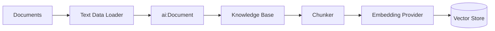

# RAG ingestion

The ingestion integration converts raw documents into vectors that the RAG query integration can retrieve. It runs once (or on a schedule) to populate your vector knowledge base. The query integration then searches that knowledge base at runtime.

This page covers building the ingestion integration in WSO2 Integrator: creating an automation, wiring up a data loader, a knowledge base, and running the integration. For retrieval and query, see [RAG query](rag-query.md).

---

## What the integration does

The `ingest` action on the Knowledge Base handles everything after document loading: it chunks each document, calls the embedding provider to produce vectors, and persists the resulting entries in the vector store.

---

:::info Prerequisites

- [WSO2 Integrator installed](../../get-started/install.md)
- A document to ingest (Markdown, plain text, or other supported format).
- A configured embedding provider. The default WSO2 provider works out of the box. Run the WSO2 Integrator command `Ballerina: Configure default WSO2 model provider` if you haven't already.

:::

---

## Step 1: Create an automation artifact

An **Automation** runs on integration startup. It is the right artifact type for a one-shot ingestion job.

1. In the design view, select **+ Add Artifact**.
2. On the Artifacts page, select **Automation** and click **Create**.

    

---

## Step 2: Add a text data loader

A **Text Data Loader** reads a file from disk and wraps its content as an `ai:Document`.

1. In the flow editor, click **+** to open the **Add Node** panel.
2. Go to **AI > RAG > Data Loader**.
3. Click **Add Data Loader** and select **Text Data Loader**.

    

4. In the configuration panel:

    | Field | Value |
    | --- | --- |
    | **Paths** | Path to the file you want to ingest, for example `/resources/knowledge.pdf` |
    | **Name** | A variable name for the loader, for example `loader` |
    | **Result Type** | The variable type, set to `ai:TextDataLoader`. |

    

5. Click **Save**.

The node appears on the right panel. It does not load yet. You call its `load` function next.

---

## Step 3: Load the documents

Call the loader's `load` function to execute the read and get back an `ai:Document[]`.

1. Click on the `loader` node and select the `load` action call.

    

2. In the form that appears, set the result variable name, for example `documents`.

    `ai:Document` is a generic content container. It holds the raw text from the source plus optional metadata (file name, URL, category) that you can use to filter results during retrieval.

    

3. Click **Save**.

    

---

## Step 4: Create a vector knowledge base

The **Vector Knowledge Base** owns the three pluggable parts of a RAG store: a vector store, an embedding provider, and a chunker.

1. Click **+** to add a node.
2. Go to **AI > RAG > Knowledge Base**.

    

3. Click **Add Knowledge Base** and select **Vector Knowledge Base**.
4. Fill in the form:

    | Field | Required | Values |
    | --- | --- | --- |
    | **Vector Store** | Yes | In-Memory Vector Store, Pinecone, pgvector, Weaviate, or Milvus. |
    | **Embedding Model** | Yes | Default Embedding Provider (WSO2) or any other listed embedding provider. Produces 1536-dimensional dense vectors. |
    | **Chunker** | No | `ai:AUTO` is the default and works for most cases. Switch to a specific chunker if retrieval quality degrades: use **Markdown** for `.md` files, **HTML** for web pages, or **Generic Recursive** for plain text. |
    | **Knowledge Base Name** | — | For example, `knowledgeBase` |

    

5. Click **Save**.

:::warning
In-memory storage is not durable. All vectors are lost when the integration stops. For production integrations, configure an external vector store and set `vectorDimension: 1536` to match the WSO2 embedding provider's output.
:::

:::warning
Use the same embedding provider for ingestion and retrieval. Vectors produced by different providers are not comparable. If you ingest with the WSO2 default provider and retrieve with OpenAI (or vice versa), the similarity search returns no useful results.
:::

See [Vector Stores](../components/vector-stores.md) and [Knowledge Bases](../components/knowledge-bases.md) for the full configuration reference.

---

## Step 5: Ingest the documents

Call `ingest` on the knowledge base to chunk, embed, and persist the loaded documents.

1. Click **+** after the knowledge base creation node.
2. Select the `knowledgeBase` variable and choose the **Ingest** action.

    

3. Set **Documents** to the `documents` variable from Step 3.

    

4. Click **Save**.

    

The `ingest` action:

1. Passes each `ai:Document` through the configured Chunker.
2. Sends each chunk to the Embedding Provider to produce a vector.
3. Persists the vector + chunk content in the Vector Store.

---

## Step 6: Add a completion log

Add a **Log Info** node after the ingest call to confirm the integration finished.

| Field | Value |
| --- | --- |
| **Message** | For example, `"RAG ingestion complete."` |

This is optional but useful during development and when the automation runs on a schedule.

---

## Running the integration

Click **Run** at the top right of the project view. WSO2 Integrator compiles and starts the integration. Because the artifact is an Automation, the ingestion function executes immediately on startup.

Watch the **Run** panel output for the log message. If the run fails, check:

- The file path is correct relative to the project root.
- The WSO2 model provider is configured (`Ballerina: Configure default WSO2 model provider`).
- The embedding provider and vector store are reachable (for external stores).

    

---

## Keeping the knowledge base up to date

The in-memory store is rebuilt on every restart, so re-running the integration re-ingests automatically. For durable stores:

- Use **Delete By Filter** before re-ingesting a document to avoid duplicates. Filter by a metadata field like `source` or `version`.
- Schedule the automation with a trigger (for example, an HTTP call, a cron, or a file-watch event) rather than running it once.

See [Knowledge Bases — delete by filter](../components/knowledge-bases.md#public-actions) for details.

---

## What's next

- **[RAG query](rag-query.md)** — retrieve chunks at runtime and generate grounded responses.
- **[Knowledge Bases](../components/knowledge-bases.md)** — ingest, retrieve, and delete-by-filter reference.
- **[Vector Stores](../components/vector-stores.md)** — picking and configuring a production store.
- **[Embedding Providers](../components/embedding-providers.md)** — available providers and dimension requirements.
- **[Chunkers](../components/chunkers.md)** — controlling how documents are split before ingest.
