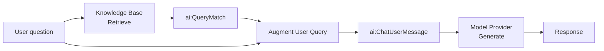

# RAG query

The query integration runs on every user request. It retrieves relevant chunks from the vector knowledge base populated during ingestion, combines them with the user's question, and calls the LLM to produce a grounded response.

This page covers building the query integration in WSO2 Integrator: wiring up retrieve, augment, and generate nodes, and testing the endpoint.

:::info
Complete [RAG ingestion](rag-ingestion.md) before starting this page. The query integration reads from the same Knowledge Base that ingestion writes to.
:::

---

## What the integration does



The four nodes — **Retrieve**, **Augment User Query**, **Generate**, and **Return** — map directly to Steps 3–7 below.

---

:::info Prerequisites

- [WSO2 Integrator installed](../../get-started/install.md)
- The ingestion integration from [RAG ingestion](rag-ingestion.md) has been run at least once so the Knowledge Base contains vectors.
- The same Knowledge Base and Embedding Provider used during ingestion are available in this project.
- A configured model provider. The default WSO2 provider works out of the box. Run `Ballerina: Configure default WSO2 model provider` if you haven't already.
- An **HTTP service** with a `POST /query` resource and a `userQuery` string payload parameter. See Step 2 below.

:::

---

## Step 1: Create the integration

1. Open the `rag-pipeline` project in WSO2 Integrator and select **+ Add** in the **Integrations & Libraries** section.

    

2. In the **Add New Integration** form, set **Integration Name** to `Rag query` and select **Add Integration**.

    

---

## Step 2: Create an HTTP service

1. In the design view, select **+ Add Artifact**.

    

2. Under **Integration as API**, select **HTTP Service**.

    

3. Leave **Design From Scratch** selected, leave the base path as `/`, and select **Create**.

4. In the HTTP Service editor, select **+ Add Resource**. A method selection panel opens on the right.

    

5. Select **POST** from the method list.

    

6. In the **New Resource Configuration** panel, set **Resource Path** to `query`.

7. Select **+ Define Payload**, add a parameter named `userQuery` of type `string`, then select **Save**.

    

---

## Step 3: Retrieve from the knowledge base

The **Retrieve** action queries the Knowledge Base for chunks most similar to the user's question.

1. In the flow editor, click **+** to open the **Add Node** panel.
2. Go to **AI > RAG > Knowledge Base** and select the **Retrieve** action.

    :::info
    If you don't have a Knowledge Base yet, create one first by following [Knowledge Bases](../components/knowledge-bases.md). Use the same Knowledge Base as ingestion. For the in-memory knowledge base, both ingestion and querying must be done in the same integration.
    :::

    

3. Configure the node:

    | Field | Required | Value |
    | --- | --- | --- |
    | **Knowledge Base** | Yes | The same Knowledge Base created during ingestion, for example `knowledgeBase`. |
    | **Query** | Yes | Bind to the incoming user question, for example `userQuery`. |
    | **Top K** | No | Number of chunks to return. Default is `10`. Increase if relevant content is being missed; use `-1` to return all. |
    | **Filters** | No | Metadata filters to restrict results. Useful for multi-tenant scenarios where users should only see their own documents. |
    | **Result variable** | — | For example, `context` |

4. Click **Save**.

    

The result is an array of `ai:QueryMatch` values. Each entry contains a chunk and its similarity score against the query.

:::info
Retrieve is the read-side counterpart to Ingest. It must point to the same Knowledge Base and the same Embedding Provider. Pointing to a different one returns no useful results.
:::


---

## Step 4: Augment the user query

The **Augment User Query** node combines the retrieved chunks with the original question into a single formatted `ai:ChatUserMessage` ready for the LLM.

1. Click **+** after the Retrieve node.
2. Go to **AI > RAG > Augment Query**.
3. Configure the node:

    | Field | Required | Value |
    | --- | --- | --- |
    | **Context** | Yes | The retrieval results, for example `context`. |
    | **Query** | Yes | The original user question, for example `userQuery`. |
    | **Result variable** | — | For example, `augmentedUserMsg` |

4. Click **Save**.

    

This step handles prompt construction automatically. You do not need to manually interleave chunks and questions.


---

## Step 5: Add a model provider

1. Click **+** after the Augment node.
2. Go to **AI > Model Provider**.
3. Select a model provider, for example **Default Model Provider (WSO2)**, and set the name to `defaultModel`.
4. Click **Save**.


---

## Step 6: Generate the response

The **Generate** action calls the LLM with the augmented message and returns the model's answer.

1. Click **+** after the model provider node.
2. Select the `defaultModel` variable and choose the **Generate** action.

    

3. Configure the node:

    | Field | Required | Value |
    | --- | --- | --- |
    | **Prompt** | Yes | The augmented message content, for example `check augmentedUserMsg.content.ensureType()`. |
    | **Expected type** | No | Set to `string` for plain-text responses. Use a record type to get a structured response. |
    | **Result variable** | — | For example, `response` |

4. Click **Save**.

    

    

---

## Step 7: Return the response

1. Click **+** after the Generate node.
2. Select **Return**.
3. Set the expression to `response`.
4. Click **Save**.


---

## Running and testing

Click **Run** at the top right. Once the integration starts, test the endpoint:

```bash
curl -X POST http://localhost:9090/query \
  -H "Content-Type: application/json" \
  -d '"<your question>"'
```

The response will be grounded in the documents you ingested.

---

## Tuning retrieval quality

| Parameter | Where | What it does |
| --- | --- | --- |
| **Top K** | Retrieve node | Controls how many chunks are passed to the LLM. Too few and relevant content is missed; too many and the model gets noisy context. Start at `5`–`10`. |
| **Filters** | Retrieve node | Restrict results by metadata. Use a `source` or `tenantId` field to isolate results per user or document set. |
| **Chunker** | Knowledge Base (ingestion) | Affects chunk boundaries and size. Switch from `ai:AUTO` to a structure-aware chunker (Markdown, HTML) if retrieval quality is poor. Re-ingest after changing. |

---

## What's next

- **[RAG ingestion](rag-ingestion.md)** — populate the knowledge base the query integration reads from.
- **[Knowledge Bases](../components/knowledge-bases.md)** — retrieve, delete-by-filter, and tuning reference.
- **[Embedding Providers](../components/embedding-providers.md)** — available providers and dimension requirements.
- **[Chunkers](../components/chunkers.md)** — controlling how documents are split for better retrieval.
