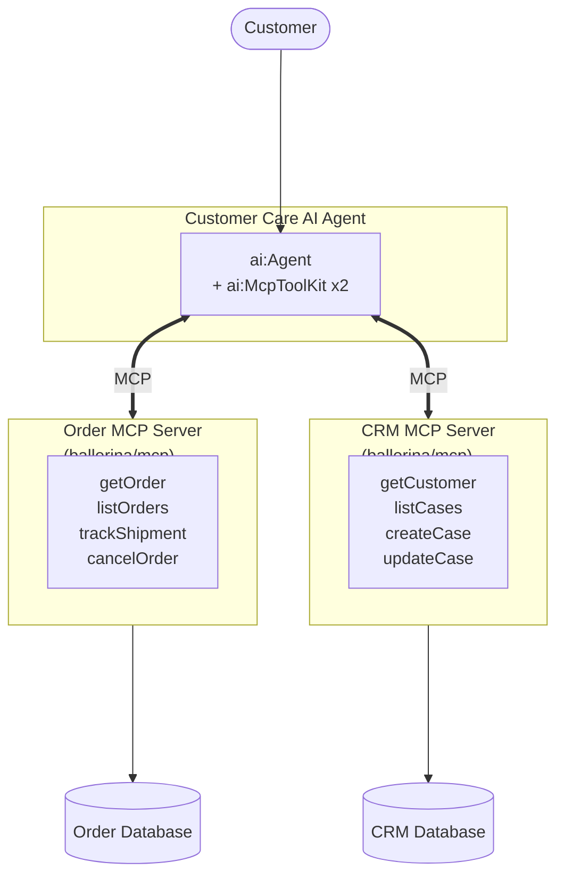

# Building a Customer Care Agent with MCP

**Time:** 45 minutes | **Level:** Intermediate | **What you'll build:** A customer care AI Agent that connects to CRM and order management systems through MCP (Model Context Protocol) servers, enabling natural language access to customer and order data.

In this tutorial, you build a customer care AI Agent that uses MCP to bridge the gap between an LLM and your enterprise systems. Instead of writing tool functions directly inside the agent, you expose your CRM and order management APIs as MCP servers using the built-in `ballerina/mcp` module. The agent then connects to those servers with a single `ai:McpToolKit` and uses their remote functions as tools.

Both `ballerina/ai` and `ballerina/mcp` ship with the WSO2 Integrator distribution, so there is no separate dependency to pull.

## Prerequisites

- [WSO2 Integrator VS Code extension installed](/docs/get-started/install)
- A default model provider configured via **"Configure default WSO2 Model Provider"** in VS Code, or an OpenAI API key
- Familiarity with the [MCP overview](/docs/genai/mcp/overview)

## Architecture



## Step 1: Create the project

```toml
# Ballerina.toml
[package]
org = "myorg"
name = "customer_care_mcp"
version = "0.1.0"
distribution = "2201.13.0"
```

Both `ballerina/ai` and `ballerina/mcp` are bundled, so no extra dependency blocks are needed. You will still import `ballerinax/mysql` for the databases when you add it to your source files.

```toml
# Config.toml
orderDbHost = "localhost"
orderDbPort = 3306
orderDbUser = "root"
orderDbPassword = "password"
orderDbName = "orders_db"
crmDbHost = "localhost"
crmDbPort = 3306
crmDbUser = "root"
crmDbPassword = "password"
crmDbName = "crm_db"
orderMcpUrl = "http://localhost:9091/mcp"
crmMcpUrl = "http://localhost:9092/mcp"
```

## Step 2: Define data types

```ballerina
// types.bal
type Customer record {|
    string customerId;
    string name;
    string email;
    string phone;
    string tier;           // "standard", "premium", "enterprise"
    string accountStatus;  // "active", "suspended", "closed"
|};

type Order record {|
    string orderId;
    string customerId;
    string status;
    string orderDate;
    decimal total;
    string? trackingNumber;
    string? estimatedDelivery;
    OrderItem[] items;
|};

type OrderItem record {|
    string productId;
    string productName;
    int quantity;
    decimal unitPrice;
|};

type SupportCase record {|
    string caseId;
    string customerId;
    string subject;
    string description;
    string priority;       // "low", "medium", "high", "critical"
    string status;         // "open", "in_progress", "resolved", "closed"
    string? assignedTo;
    string createdAt;
|};

type ShipmentTracking record {|
    string trackingNumber;
    string carrier;
    string status;
    string lastLocation;
    string? estimatedDelivery;
    TrackingEvent[] events;
|};

type TrackingEvent record {|
    string timestamp;
    string location;
    string description;
|};

type CancelResult record {|
    boolean success;
    string message;
|};
```

## Step 3: Create the order MCP server

The order MCP server exposes order management capabilities as MCP remote functions. Each remote function is automatically turned into an MCP tool; the doc comment becomes the tool description and parameter doc comments become the parameter descriptions.

```ballerina
// order_mcp_server.bal
import ballerina/mcp;
import ballerinax/mysql;
import ballerina/http;

configurable string orderDbHost = ?;
configurable int orderDbPort = ?;
configurable string orderDbUser = ?;
configurable string orderDbPassword = ?;
configurable string orderDbName = ?;

final mysql:Client orderDb = check new (
    host = orderDbHost,
    port = orderDbPort,
    user = orderDbUser,
    password = orderDbPassword,
    database = orderDbName
);

final http:Client shippingApi = check new ("https://api.shipping-provider.com");

listener mcp:Listener orderMcpListener = new (9091);

service mcp:Service /mcp on orderMcpListener {

    # Retrieve order details by order ID.
    # Returns status, items, total, and tracking information.
    #
    # + orderId - The order identifier
    # + return - The matching order
    remote function getOrder(string orderId) returns Order|error {
        Order orderRecord = check orderDb->queryRow(
            `SELECT * FROM orders WHERE order_id = ${orderId}`
        );
        OrderItem[] items = check from OrderItem item in orderDb->query(
            `SELECT * FROM order_items WHERE order_id = ${orderId}`
        ) select item;
        orderRecord.items = items;
        return orderRecord;
    }

    # List recent orders for a customer, newest first.
    #
    # + customerId - The customer identifier
    # + status - Optional status filter (for example, "shipped")
    # + return - Up to ten matching orders
    remote function listOrders(string customerId, string? status = ())
            returns Order[]|error {
        if status is string {
            return from Order orderRecord in orderDb->query(
                `SELECT * FROM orders WHERE customer_id = ${customerId}
                   AND status = ${status}
                 ORDER BY order_date DESC LIMIT 10`
            ) select orderRecord;
        }
        return from Order orderRecord in orderDb->query(
            `SELECT * FROM orders WHERE customer_id = ${customerId}
             ORDER BY order_date DESC LIMIT 10`
        ) select orderRecord;
    }

    # Track a shipment using the carrier tracking number.
    #
    # + trackingNumber - The carrier tracking number
    # + return - Shipment tracking details
    remote function trackShipment(string trackingNumber)
            returns ShipmentTracking|error {
        return shippingApi->get(string `/track/${trackingNumber}`);
    }

    # Cancel an order if it has not already been shipped or delivered.
    #
    # + orderId - The order to cancel
    # + reason - The cancellation reason
    # + return - Whether the cancellation succeeded
    remote function cancelOrder(string orderId, string reason)
            returns CancelResult|error {
        Order existing = check self.getOrder(orderId);
        if existing.status == "shipped" || existing.status == "delivered" {
            return {
                success: false,
                message: string `Cannot cancel order '${orderId}' because it has already been ${existing.status}.`
            };
        }
        _ = check orderDb->execute(
            `UPDATE orders SET status = 'cancelled', cancel_reason = ${reason}
             WHERE order_id = ${orderId}`
        );
        return {success: true, message: string `Order '${orderId}' has been cancelled.`};
    }
}
```

## Step 4: Create the CRM MCP server

```ballerina
// crm_mcp_server.bal
import ballerina/mcp;
import ballerinax/mysql;
import ballerina/uuid;
import ballerina/time;

configurable string crmDbHost = ?;
configurable int crmDbPort = ?;
configurable string crmDbUser = ?;
configurable string crmDbPassword = ?;
configurable string crmDbName = ?;

final mysql:Client crmDb = check new (
    host = crmDbHost,
    port = crmDbPort,
    user = crmDbUser,
    password = crmDbPassword,
    database = crmDbName
);

listener mcp:Listener crmMcpListener = new (9092);

service mcp:Service /mcp on crmMcpListener {

    # Look up a customer by customer ID, email, or phone number.
    #
    # + query - Customer ID, email, or phone
    # + return - The matching customer record
    remote function getCustomer(string query) returns Customer|error {
        return crmDb->queryRow(
            `SELECT * FROM customers
             WHERE customer_id = ${query} OR email = ${query} OR phone = ${query}`
        );
    }

    # List support cases for a customer, newest first.
    #
    # + customerId - Customer identifier
    # + status - Optional status filter
    # + return - Up to ten matching cases
    remote function listCases(string customerId, string? status = ())
            returns SupportCase[]|error {
        if status is string {
            return from SupportCase c in crmDb->query(
                `SELECT * FROM support_cases
                 WHERE customer_id = ${customerId} AND status = ${status}
                 ORDER BY created_at DESC LIMIT 10`
            ) select c;
        }
        return from SupportCase c in crmDb->query(
            `SELECT * FROM support_cases
             WHERE customer_id = ${customerId}
             ORDER BY created_at DESC LIMIT 10`
        ) select c;
    }

    # Create a new support case for a customer.
    # Use when an issue needs to be tracked or escalated.
    #
    # + customerId - Customer identifier
    # + subject - Short subject line
    # + description - Detailed description of the issue
    # + priority - One of `low`, `medium`, `high`, `critical`
    # + return - The newly created support case
    remote function createCase(string customerId, string subject,
            string description, string priority = "medium")
            returns SupportCase|error {
        string caseId = string `CASE-${uuid:createType1AsString().substring(0, 8)}`;
        string now = time:utcToString(time:utcNow());

        _ = check crmDb->execute(
            `INSERT INTO support_cases
                (case_id, customer_id, subject, description, priority, status, created_at)
             VALUES (${caseId}, ${customerId}, ${subject}, ${description},
                     ${priority}, 'open', ${now})`
        );
        return {
            caseId,
            customerId,
            subject,
            description,
            priority,
            status: "open",
            assignedTo: (),
            createdAt: now
        };
    }

    # Update the status or assignee of an existing support case.
    #
    # + caseId - Case identifier to update
    # + status - Optional new status
    # + assignedTo - Optional assignee
    # + return - `()` on success
    remote function updateCase(string caseId, string? status = (),
            string? assignedTo = ()) returns error? {
        if status is string {
            _ = check crmDb->execute(
                `UPDATE support_cases SET status = ${status}
                 WHERE case_id = ${caseId}`
            );
        }
        if assignedTo is string {
            _ = check crmDb->execute(
                `UPDATE support_cases SET assigned_to = ${assignedTo}
                 WHERE case_id = ${caseId}`
            );
        }
    }
}
```

## Step 5: Build the AI Agent with MCP Tool Kits

On the agent side, `ai:McpToolKit` discovers the tools exposed by each MCP server and turns them into agent tools automatically. You can pass one or more tool kits to the agent in the `tools` array.

```ballerina
// agent.bal
import ballerina/ai;

configurable string orderMcpUrl = ?;
configurable string crmMcpUrl = ?;

final ai:McpToolKit orderMcp = check new (orderMcpUrl);
final ai:McpToolKit crmMcp = check new (crmMcpUrl);

final ai:Agent customerCareAgent = check new (
    systemPrompt = {
        role: "Customer Care Agent",
        instructions: string `You are a Customer Care Agent for Acme Commerce.

Role:
- Help customers with order inquiries, shipment tracking, account questions, and issue resolution.
- Provide professional, empathetic, and efficient support.

Available capabilities (via MCP tool kits):
- Order Management: Look up orders, track shipments, list order history, cancel orders.
- CRM: Look up customer profiles, view and create support cases, update case statuses.

Guidelines:
- Always verify the customer's identity before sharing account details.
- Use the order tools to check order status — never guess or assume.
- Create a support case for any issue that cannot be resolved immediately.
- For premium and enterprise customers, acknowledge their tier and provide priority service.
- Escalate critical issues (data breach, fraud) by creating a high-priority case.
- Keep responses concise but thorough. Always include relevant IDs (order, case, tracking).
- If you cannot resolve an issue, clearly explain the next steps and expected timeline.`
    },
    tools = [orderMcp, crmMcp],
    model = check ai:getDefaultModelProvider()
);
```

:::info One toolkit, many tools
`ai:McpToolKit` is passed directly in the `tools` array — you do not need to enumerate individual tools. Every remote function on the MCP service becomes a tool the agent can invoke.
:::

## Step 6: Expose the Agent as a Chat Service

```ballerina
// service.bal
import ballerina/ai;

service /care on new ai:Listener(8090) {

    # Chat endpoint for customer inquiries.
    #
    # + request - Chat request containing the session ID and user message
    # + return - The agent's response
    resource function post chat(ai:ChatReqMessage request)
            returns ai:ChatRespMessage|error {
        string response = check customerCareAgent.run(request.message, request.sessionId);
        return {message: response};
    }
}
```

## Step 7: Run and test

1. Start the MCP servers and the agent service. Because each file contains a listener, you can run them all from the same package:

   ```bash
   bal run
   ```

   Ballerina will start all three listeners: the order MCP server on 9091, the CRM MCP server on 9092, and the agent chat service on 8090.

2. Look up an order:
   ```bash
   curl -X POST http://localhost:8090/care/chat \
     -H "Content-Type: application/json" \
     -d '{"sessionId": "cust-001", "message": "What is the status of order ORD-98765?"}'
   ```

3. Track a shipment in the same session:
   ```bash
   curl -X POST http://localhost:8090/care/chat \
     -H "Content-Type: application/json" \
     -d '{"sessionId": "cust-001", "message": "Can you track my shipment? The tracking number is TRK-123456."}'
   ```

4. Report an issue and let the agent create a case:
   ```bash
   curl -X POST http://localhost:8090/care/chat \
     -H "Content-Type: application/json" \
     -d '{"sessionId": "cust-001", "message": "I received the wrong item in order ORD-98765 — red jacket instead of blue."}'
   ```

5. Cancel an order:
   ```bash
   curl -X POST http://localhost:8090/care/chat \
     -H "Content-Type: application/json" \
     -d '{"sessionId": "cust-001", "message": "Please cancel order ORD-11111. I found a better price."}'
   ```

## What you built

You now have a customer care AI Agent that:
- Exposes order and CRM data through two MCP servers built with `ballerina/mcp`
- Consumes both servers from an `ai:Agent` using `ai:McpToolKit`
- Looks up orders, tracks shipments, and cancels orders
- Retrieves customer profiles and creates and updates support cases
- Maintains conversation context across turns via `ai:Listener`
- Uses the standardized MCP protocol for clean separation between the agent and the backend systems

## What's next

- [MCP Overview](/docs/genai/mcp/overview) — Learn more about the Model Context Protocol
- [Exposing MCP Servers](/docs/genai/mcp/exposing-mcp-servers) — Build more MCP servers for other systems
- [MCP Security](/docs/genai/mcp/mcp-security) — Secure your MCP server connections
- [Agent Tracing](/docs/genai/agent-observability/agent-tracing) — Add observability to your agent
