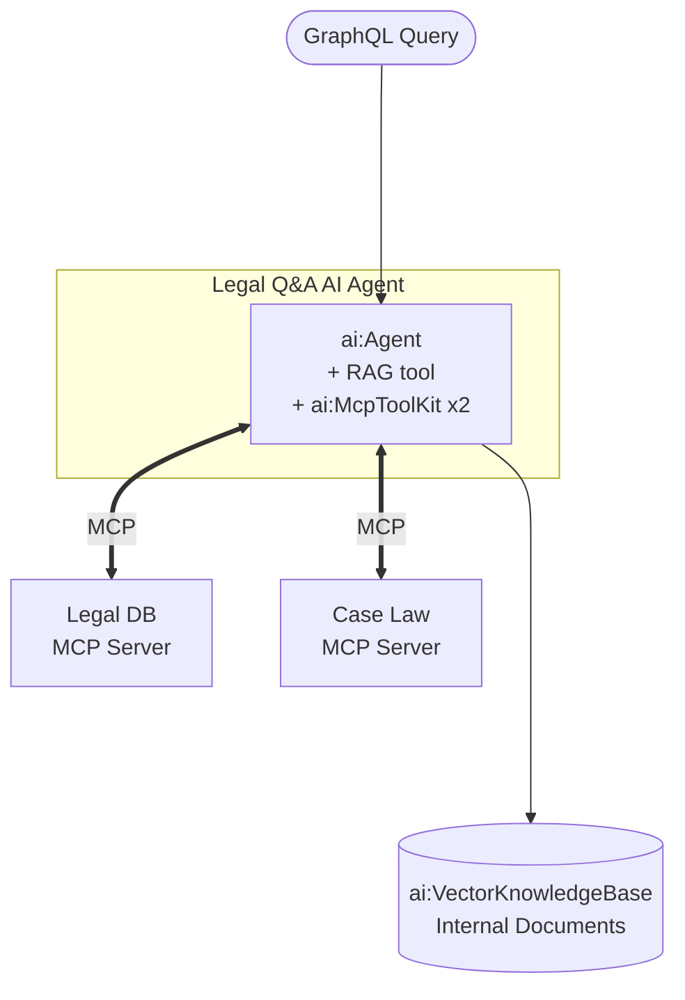

# Building a Legal Document Q&A System with MCP and RAG

**Time:** 50 minutes | **Level:** Advanced | **What you'll build:** A legal document Q&A system that combines retrieval-augmented generation (RAG) for searching internal legal documents with MCP-based access to external legal databases, exposed as a GraphQL service.

In this tutorial, you build a legal Q&A AI Agent that brings together two powerful patterns from the `ballerina/ai` and `ballerina/mcp` modules. RAG provides semantic search over your organization's contracts, policies, and legal opinions. MCP servers connect the agent to external legal databases and case law repositories. The combination lets the agent answer questions grounded in both internal documents and external legal references. The system is exposed as a GraphQL service for flexible querying by frontend applications.

Both `ballerina/ai` and `ballerina/mcp` ship with the WSO2 Integrator distribution.

## Prerequisites

- [WSO2 Integrator VS Code extension installed](/docs/get-started/install)
- A default model provider configured via **"Configure default WSO2 Model Provider"**, or an OpenAI API key
- Familiarity with [RAG Architecture](/docs/genai/rag/architecture-overview) and [MCP Overview](/docs/genai/mcp/overview)

## Architecture



## Step 1: Create the project

```toml
# Ballerina.toml
[package]
org = "myorg"
name = "legal_doc_qa"
version = "0.1.0"
distribution = "2201.13.0"
```

`ballerina/ai` and `ballerina/mcp` are bundled. You will also import `ballerina/graphql` and (optionally) `ballerina/http`.

```toml
# Config.toml
legalDbMcpUrl = "http://localhost:9091/mcp"
caseLawMcpUrl = "http://localhost:9092/mcp"
```

If you bring your own OpenAI key, add it as well:

```toml
openAiApiKey = "<your-openai-api-key>"
```

## Step 2: Define data types

```ballerina
// types.bal
type LegalSearchResult record {|
    string content;
    string source;
    float score;
|};

type CaseLawReference record {|
    string caseId;
    string caseName;
    string court;
    string date;
    string summary;
    string citation;
    string? fullTextUrl;
|};

type LegalDbRecord record {|
    string recordId;
    string title;
    string jurisdiction;
    string category;
    string status;
    string content;
    string effectiveDate;
|};

type ComplianceStatus record {|
    string title;
    string jurisdiction;
    string status;
    string lastAuditDate;
    string notes;
|};

type IngestInput record {|
    string filePath;
|};

type IngestResult record {|
    string message;
    int documentsIngested;
|};

type ChatInput record {|
    string question;
    string sessionId;
|};

type ChatResult record {|
    string answer;
    string sessionId;
    string disclaimer;
|};
```

## Step 3: Build the Internal Legal Knowledge Base with RAG

The `ballerina/ai` module gives you everything needed for RAG. For this tutorial we use the in-memory vector store for simplicity — in production you would swap in an external store such as Pinecone or pgvector by changing a single line (see the sidebar below).

```ballerina
// knowledge_base.bal
import ballerina/ai;

final ai:VectorStore vectorStore = check new ai:InMemoryVectorStore();
final ai:EmbeddingProvider embeddingProvider = check ai:getDefaultEmbeddingProvider();
final ai:KnowledgeBase legalKb =
        new ai:VectorKnowledgeBase(vectorStore, embeddingProvider);
final ai:ModelProvider modelProvider = check ai:getDefaultModelProvider();

# Ingest a legal document from disk into the legal knowledge base.
#
# + filePath - Path to the legal document (PDF or text)
# + return - The number of `ai:Document` entries ingested
public function ingestLegalDocument(string filePath) returns int|error {
    ai:DataLoader loader = check new ai:TextDataLoader(filePath);
    ai:Document|ai:Document[] docs = check loader.load();
    check legalKb.ingest(docs);
    return docs is ai:Document[] ? docs.length() : 1;
}
```

:::tip External vector store
To use Pinecone instead of `ai:InMemoryVectorStore`, import `ballerinax/ai.pinecone` and replace the store:

```ballerina
import ballerinax/ai.pinecone;

configurable string pineconeServiceUrl = ?;
configurable string pineconeApiKey = ?;

final ai:VectorStore vectorStore =
        check new pinecone:VectorStore(pineconeServiceUrl, pineconeApiKey);
```

`ai:KnowledgeBase` and every downstream call remain unchanged. The same pattern works with `ai.weaviate`, `ai.milvus`, and `ai.pgvector`.
:::

## Step 4: Create the Legal Database MCP Server

The legal database MCP server exposes regulations and compliance data using the built-in `ballerina/mcp` module. Every remote function on the service becomes an MCP tool. The doc comment is the tool description, and parameter doc comments describe the parameters.

```ballerina
// legal_db_mcp.bal
import ballerina/mcp;
import ballerinax/postgresql;
import ballerinax/postgresql.driver as _;

configurable string legalDbHost = "localhost";
configurable int legalDbPort = 5432;
configurable string legalDbUser = "postgres";
configurable string legalDbPassword = "password";
configurable string legalDbName = "legal_db";

final postgresql:Client legalDb = check new (
    host = legalDbHost,
    username = legalDbUser,
    password = legalDbPassword,
    database = legalDbName,
    port = legalDbPort
);

listener mcp:Listener legalDbMcpListener = new (9091);

service mcp:Service /mcp on legalDbMcpListener {

    # Search the legal database for regulations, statutes, or compliance requirements.
    #
    # + query - Keyword to search against title and content
    # + jurisdiction - Optional jurisdiction filter (for example, `US-CA`, `EU`)
    # + category - Optional category filter
    # + return - Up to ten matching regulations
    remote function searchRegulations(string query, string? jurisdiction = (),
            string? category = ()) returns LegalDbRecord[]|error {
        string like = string `%${query}%`;
        if jurisdiction is string && category is string {
            return from LegalDbRecord rec in legalDb->query(
                `SELECT * FROM regulations
                 WHERE (title ILIKE ${like} OR content ILIKE ${like})
                   AND jurisdiction = ${jurisdiction}
                   AND category = ${category}
                 ORDER BY effective_date DESC LIMIT 10`
            ) select rec;
        }
        if jurisdiction is string {
            return from LegalDbRecord rec in legalDb->query(
                `SELECT * FROM regulations
                 WHERE (title ILIKE ${like} OR content ILIKE ${like})
                   AND jurisdiction = ${jurisdiction}
                 ORDER BY effective_date DESC LIMIT 10`
            ) select rec;
        }
        return from LegalDbRecord rec in legalDb->query(
            `SELECT * FROM regulations
             WHERE (title ILIKE ${like} OR content ILIKE ${like})
             ORDER BY effective_date DESC LIMIT 10`
        ) select rec;
    }

    # Look up a specific regulation by its record ID.
    #
    # + recordId - Regulation record identifier
    # + return - The matching regulation
    remote function getRegulation(string recordId) returns LegalDbRecord|error {
        return legalDb->queryRow(
            `SELECT * FROM regulations WHERE record_id = ${recordId}`
        );
    }

    # Check the compliance status for a specific regulation.
    #
    # + regulationId - Regulation record identifier
    # + return - Compliance status for the organization
    remote function checkCompliance(string regulationId)
            returns ComplianceStatus|error {
        return legalDb->queryRow(
            `SELECT r.title, r.jurisdiction, c.status,
                    c.last_audit_date AS "lastAuditDate", c.notes
             FROM regulations r
             JOIN compliance_status c ON r.record_id = c.regulation_id
             WHERE r.record_id = ${regulationId}`
        );
    }
}
```

## Step 5: Create the Case Law MCP Server

```ballerina
// case_law_mcp.bal
import ballerina/mcp;
import ballerina/http;

final http:Client caseLawApi = check new ("https://api.case-law-provider.com/v1");

listener mcp:Listener caseLawMcpListener = new (9092);

service mcp:Service /mcp on caseLawMcpListener {

    # Search for case law by keyword, court, jurisdiction, or date range.
    #
    # + query - Free-text search query
    # + court - Optional court filter
    # + jurisdiction - Optional jurisdiction filter
    # + dateFrom - Optional earliest date (YYYY-MM-DD)
    # + dateTo - Optional latest date (YYYY-MM-DD)
    # + return - Matching case law references
    remote function searchCaseLaw(string query, string? court = (),
            string? jurisdiction = (), string? dateFrom = (),
            string? dateTo = ()) returns CaseLawReference[]|error {
        map<string> params = {"q": query, "limit": "10"};
        if court is string {
            params["court"] = court;
        }
        if jurisdiction is string {
            params["jurisdiction"] = jurisdiction;
        }
        if dateFrom is string {
            params["date_from"] = dateFrom;
        }
        if dateTo is string {
            params["date_to"] = dateTo;
        }
        string queryStr = "";
        foreach [string, string] [key, value] in params.entries() {
            queryStr += queryStr.length() > 0
                ? string `&${key}=${value}`
                : string `${key}=${value}`;
        }
        return caseLawApi->get(string `/cases?${queryStr}`);
    }

    # Retrieve full details for a single case.
    #
    # + caseId - Case identifier
    # + return - The full case record
    remote function getCaseDetails(string caseId) returns CaseLawReference|error {
        return caseLawApi->get(string `/cases/${caseId}`);
    }

    # Find cases that cite a given case — useful for checking whether a precedent is still valid.
    #
    # + caseId - Case identifier
    # + return - Cases that cite the supplied case
    remote function getCitingCases(string caseId)
            returns CaseLawReference[]|error {
        return caseLawApi->get(string `/cases/${caseId}/citing`);
    }
}
```

## Step 6: Build the AI Agent

The agent has three sources of knowledge:

1. A RAG tool that queries the internal legal knowledge base.
2. The legal database MCP server exposed via `ai:McpToolKit`.
3. The case law MCP server exposed via `ai:McpToolKit`.

```ballerina
// agent.bal
import ballerina/ai;

configurable string legalDbMcpUrl = ?;
configurable string caseLawMcpUrl = ?;

final ai:McpToolKit legalDbMcp = check new (legalDbMcpUrl);
final ai:McpToolKit caseLawMcp = check new (caseLawMcpUrl);

# Search the internal legal knowledge base for contracts, policies, and opinions.
# Use this for questions about company-internal documents — not external regulations
# (use searchRegulations) or case law (use searchCaseLaw) for those.
#
# + question - The legal question to research against internal documents
# + return - An answer grounded in retrieved internal document chunks
@ai:AgentTool
isolated function searchInternalLegalDocs(string question) returns string|error {
    ai:QueryMatch[] matches = check legalKb.retrieve(question, 5);
    ai:Chunk[] context = from ai:QueryMatch m in matches select m.chunk;
    ai:ChatUserMessage augmented = ai:augmentUserQuery(context, question);
    ai:ChatAssistantMessage answer = check modelProvider->chat(augmented);
    return answer.content ?: "No relevant internal documents found.";
}

final ai:Agent legalQaAgent = check new (
    systemPrompt = {
        role: "Legal Research Assistant",
        instructions: string `You are a Legal Research Assistant for the company's legal department.

Role:
- Answer legal questions by searching internal documents and external legal databases.
- Provide well-sourced, accurate legal information grounded in actual documents and case law.

Available capabilities:
- searchInternalLegalDocs (RAG): Search internal contracts, policies, opinions, and memos.
- Legal Database MCP toolkit: searchRegulations, getRegulation, checkCompliance.
- Case Law MCP toolkit: searchCaseLaw, getCaseDetails, getCitingCases.

Guidelines:
- ALWAYS cite your sources: document names, regulation IDs, and case citations.
- Search internal documents first for company-specific questions.
- Use the legal database for regulatory and compliance questions.
- Use case law search for precedent and judicial interpretation questions.
- Clearly distinguish between internal company policies and external legal requirements.
- ALWAYS include a disclaimer that your responses are for informational purposes only
  and do not constitute legal advice.
- Rate your confidence as high, medium, or low based on source quality.
- For questions that require legal judgment, recommend consulting a qualified attorney.`
    },
    tools = [searchInternalLegalDocs, legalDbMcp, caseLawMcp],
    model = modelProvider
);
```

:::info Mixing RAG and MCP
The `tools` array can hold a mix of `@ai:AgentTool` functions and `ai:McpToolKit` instances. The agent will look at every tool's doc comment (and each MCP tool's description) to decide which to call for a given user question.
:::

## Step 7: Expose the Agent as a GraphQL Service

GraphQL is a good fit here because the frontend may want to ingest documents, run search queries, or ask natural-language questions through a single endpoint.

```ballerina
// service.bal
import ballerina/graphql;

service /legal on new graphql:Listener(8090) {

    # Ask the legal Q&A AI Agent a question.
    #
    # + input - Chat input containing the question and session ID
    # + return - The agent's answer with a disclaimer
    remote function askQuestion(ChatInput input) returns ChatResult|error {
        string response = check legalQaAgent.run(input.question, input.sessionId);
        return {
            answer: response,
            sessionId: input.sessionId,
            disclaimer: "This response is for informational purposes only and does not " +
                "constitute legal advice. Please consult with a qualified attorney " +
                "for legal guidance."
        };
    }

    # Ingest a legal document into the internal knowledge base.
    #
    # + input - Ingestion input
    # + return - A summary of the ingestion
    remote function ingestDocument(IngestInput input) returns IngestResult|error {
        int count = check ingestLegalDocument(input.filePath);
        return {
            message: string `Successfully ingested '${input.filePath}'.`,
            documentsIngested: count
        };
    }

    # Retrieve the top matching document excerpts for a raw query, without the agent.
    #
    # + query - The search query
    # + topK - Maximum number of results
    # + return - The top-k query matches
    resource function get searchDocuments(string query, int topK = 5)
            returns LegalSearchResult[]|error {
        ai:QueryMatch[] matches = check legalKb.retrieve(query, topK);
        return from ai:QueryMatch m in matches
            select {
                content: m.chunk.content,
                source: m.chunk.metadata?.source ?: "unknown",
                score: m.score
            };
    }
}
```

## Step 8: Run and Test

1. Start the MCP servers and the GraphQL service. All three listeners live in the same package, so a single `bal run` brings up everything:
   ```bash
   bal run
   ```

2. Ingest a legal document:
   ```bash
   curl -X POST http://localhost:8090/legal \
     -H "Content-Type: application/json" \
     -d '{
       "query": "mutation { ingestDocument(input: { filePath: \"./docs/legal/nda-template.pdf\" }) { message documentsIngested } }"
     }'
   ```

3. Ask a question about internal documents (the agent routes it to the RAG tool):
   ```bash
   curl -X POST http://localhost:8090/legal \
     -H "Content-Type: application/json" \
     -d '{
       "query": "mutation { askQuestion(input: { sessionId: \"legal-001\", question: \"What are the termination clauses in our standard NDA?\" }) { answer disclaimer } }"
     }'
   ```

4. Ask a regulatory question (the agent routes it to the legal DB MCP toolkit):
   ```bash
   curl -X POST http://localhost:8090/legal \
     -H "Content-Type: application/json" \
     -d '{
       "query": "mutation { askQuestion(input: { sessionId: \"legal-001\", question: \"What GDPR requirements apply to our data processing activities?\" }) { answer disclaimer } }"
     }'
   ```

5. Ask about case law (the agent routes to the case law MCP toolkit):
   ```bash
   curl -X POST http://localhost:8090/legal \
     -H "Content-Type: application/json" \
     -d '{
       "query": "mutation { askQuestion(input: { sessionId: \"legal-001\", question: \"Are there recent cases about NDA enforceability in California?\" }) { answer disclaimer } }"
     }'
   ```

6. Search internal documents directly without going through the agent:
   ```bash
   curl -X POST http://localhost:8090/legal \
     -H "Content-Type: application/json" \
     -d '{
       "query": "{ searchDocuments(query: \"intellectual property\", topK: 5) { content source score } }"
     }'
   ```

## What you built

You now have a legal document Q&A system that:
- Ingests internal legal documents into an `ai:VectorKnowledgeBase`
- Searches internal documents using a RAG-in-a-tool pattern
- Queries regulatory data through an MCP server built with `ballerina/mcp`
- Searches case law through a second MCP server
- Combines all three sources inside a single `ai:Agent`
- Exposes everything through a flexible GraphQL API

## What's next

- [RAG Architecture Overview](/docs/genai/rag/architecture-overview) — Deep dive into RAG design patterns
- [MCP Security](/docs/genai/mcp/mcp-security) — Secure your MCP connections for sensitive legal data
- [AI Governance and Security](/docs/genai/reference/ai-governance) — Implement governance for legal AI
- [Content Filtering](/docs/genai/guardrails/content-filtering) — Add output guardrails for legal accuracy
