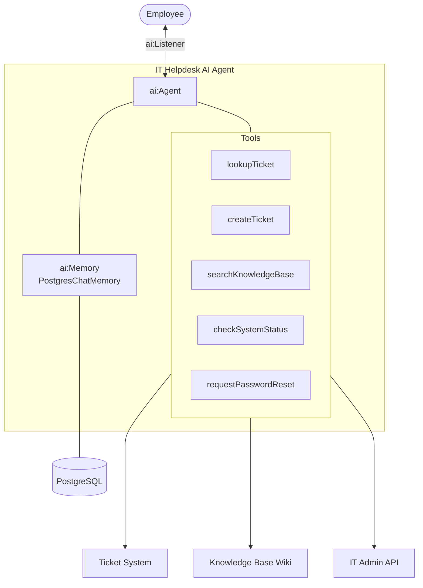

# Building an IT Helpdesk Chatbot with Persistent Memory

**Time:** 40 minutes | **Level:** Intermediate | **What you'll build:** An IT helpdesk AI Agent that assists employees with technical issues, looks up support tickets, searches a knowledge base, and remembers conversations across service restarts using a PostgreSQL-backed `ai:Memory` implementation.

In this tutorial, you build an IT support AI Agent with persistent memory so that returning employees do not need to repeat their issues. The chatbot connects to a ticketing system and an internal knowledge base, and it exposes its interface over the `ai:Listener` chat protocol. For persistence, you implement the `ai:Memory` interface against PostgreSQL — the built-in in-process memory is great for development but is lost on restart.

## Prerequisites

- [WSO2 Integrator VS Code extension installed](/docs/get-started/install)
- A default model provider configured via **"Configure default WSO2 Model Provider"**, or an OpenAI API key
- PostgreSQL running locally (or another database of your choice — you only need to adapt the `ai:Memory` implementation)
- Familiarity with [Memory Configuration](/docs/genai/agents/memory-configuration)

## Architecture



## Step 1: Create the project

```toml
# Ballerina.toml
[package]
org = "myorg"
name = "it_helpdesk_chatbot"
version = "0.1.0"
distribution = "2201.13.0"
```

`ballerina/ai` is bundled with the distribution. You will also use `ballerinax/postgresql` and `ballerina/http`, which are imported in the source files.

## Step 2: Set Up Configuration

```toml
# Config.toml
dbHost = "localhost"
dbPort = 5432
dbUser = "postgres"
dbPassword = "password"
dbName = "helpdesk"
ticketApiUrl = "http://localhost:8080/api/tickets"
kbApiUrl = "http://localhost:8081/api/kb"
itAdminApiUrl = "http://localhost:8082/api/admin"
```

```ballerina
// config.bal
configurable string dbHost = ?;
configurable int dbPort = ?;
configurable string dbUser = ?;
configurable string dbPassword = ?;
configurable string dbName = ?;
configurable string ticketApiUrl = ?;
configurable string kbApiUrl = ?;
configurable string itAdminApiUrl = ?;
```

Also create the `chat_history` table before running the application:

```sql
CREATE TABLE IF NOT EXISTS chat_history (
    id BIGSERIAL PRIMARY KEY,
    session_id TEXT NOT NULL,
    role TEXT NOT NULL,
    content TEXT NOT NULL,
    created_at TIMESTAMP NOT NULL DEFAULT NOW()
);
CREATE INDEX IF NOT EXISTS idx_chat_history_session ON chat_history(session_id);
```

## Step 3: Define Data Types

```ballerina
// types.bal
type SupportTicket record {|
    string ticketId;
    string employeeId;
    string subject;
    string description;
    string category;       // "hardware", "software", "network", "access", "other"
    string priority;       // "low", "medium", "high", "critical"
    string status;         // "open", "in_progress", "waiting", "resolved", "closed"
    string? assignedTo;
    string createdAt;
    string? resolvedAt;
|};

type KbArticle record {|
    string articleId;
    string title;
    string content;
    string category;
    string[] tags;
    float relevanceScore;
|};

type SystemStatus record {|
    string system;
    string state;   // "operational", "degraded", "outage"
    string updatedAt;
    string? message;
|};

type PasswordResetResult record {|
    boolean success;
    string message;
    string? temporaryPassword;
    string? expiresAt;
|};

type CreateTicketInput record {|
    string employeeId;
    string subject;
    string description;
    string category;
    string priority;
|};
```

## Step 4: Implement Persistent Memory with `ai:Memory`

The `ai:Memory` interface has three methods: `get`, `update`, and `delete`. Implementing it lets you back the agent's conversation history with any storage you like. Here we store chat messages in PostgreSQL so they survive restarts.

```ballerina
// persistent_memory.bal
import ballerina/ai;
import ballerinax/postgresql;
import ballerinax/postgresql.driver as _;
import ballerina/sql;

final postgresql:Client dbClient = check new (
    host = dbHost,
    username = dbUser,
    password = dbPassword,
    database = dbName,
    port = dbPort
);

# Persistent `ai:Memory` implementation backed by PostgreSQL.
# Each chat message is stored as a row keyed by session ID.
isolated class PostgresChatMemory {
    *ai:Memory;

    private final postgresql:Client db;

    isolated function init(postgresql:Client db) {
        self.db = db;
    }

    isolated function get(string sessionId)
            returns ai:ChatMessage[]|ai:MemoryError {
        stream<record {string role; string content;}, sql:Error?> rows =
            self.db->query(`SELECT role, content FROM chat_history
                            WHERE session_id = ${sessionId}
                            ORDER BY id ASC`);
        ai:ChatMessage[] messages = [];
        error? e = from record {string role; string content;} row in rows
            do {
                if row.role == "user" {
                    ai:ChatUserMessage userMsg = {
                        role: ai:USER,
                        content: row.content
                    };
                    messages.push(userMsg);
                } else if row.role == "assistant" {
                    ai:ChatAssistantMessage asstMsg = {
                        role: ai:ASSISTANT,
                        content: row.content
                    };
                    messages.push(asstMsg);
                }
            };
        if e is error {
            return error ai:MemoryError("failed to load chat history", e);
        }
        return messages;
    }

    isolated function update(string sessionId,
            ai:ChatMessage|ai:ChatMessage[] message)
            returns ai:MemoryError? {
        ai:ChatMessage[] toInsert = message is ai:ChatMessage[]
            ? message
            : [message];
        foreach ai:ChatMessage m in toInsert {
            string role = m.role.toString();
            string content = m is ai:ChatUserMessage || m is ai:ChatAssistantMessage
                ? (m.content ?: "")
                : "";
            sql:ExecutionResult|sql:Error result = self.db->execute(
                `INSERT INTO chat_history (session_id, role, content)
                 VALUES (${sessionId}, ${role}, ${content})`
            );
            if result is sql:Error {
                return error ai:MemoryError("failed to store chat message", result);
            }
        }
    }

    isolated function delete(string sessionId) returns ai:MemoryError? {
        sql:ExecutionResult|sql:Error result = self.db->execute(
            `DELETE FROM chat_history WHERE session_id = ${sessionId}`
        );
        if result is sql:Error {
            return error ai:MemoryError("failed to clear chat history", result);
        }
    }
}

final ai:Memory persistentMemory = new PostgresChatMemory(dbClient);
```

:::info In-process vs. persistent memory
`ai:Listener` ships with a sensible in-process memory that survives across requests within the same process. For durability across restarts or horizontal scaling, swap in a custom `ai:Memory` implementation like the one above.
:::

## Step 5: Define Agent Tools

```ballerina
// tools.bal
import ballerina/ai;
import ballerina/http;

final http:Client ticketApi = check new (ticketApiUrl);
final http:Client kbApi = check new (kbApiUrl);
final http:Client itAdminApi = check new (itAdminApiUrl);

# Look up an existing IT support ticket by ticket ID.
# Use this when an employee asks about the status of a previously reported issue.
#
# + ticketId - Ticket ID in the format `TKT-XXXXX`
# + return - The matching ticket
@ai:AgentTool
isolated function lookupTicket(string ticketId) returns SupportTicket|error {
    return ticketApi->get(string `/tickets/${ticketId}`);
}

# List the recent support tickets for an employee.
# Use this when an employee wants to see their ticket history.
#
# + employeeId - Employee identifier
# + status - Optional status filter ("open", "in_progress", "resolved", "all")
# + return - Matching tickets, newest first
@ai:AgentTool
isolated function listEmployeeTickets(string employeeId, string status = "all")
        returns SupportTicket[]|error {
    string suffix = status == "all" ? "" : string `&status=${status}`;
    return ticketApi->get(string `/tickets?employeeId=${employeeId}${suffix}`);
}

# Create a new IT support ticket.
# Use this when an employee reports a new issue that cannot be resolved through
# the knowledge base or basic troubleshooting.
#
# + input - Ticket creation payload
# + return - The newly created ticket
@ai:AgentTool
isolated function createTicket(CreateTicketInput input) returns SupportTicket|error {
    return ticketApi->post("/tickets", input);
}

# Search the IT knowledge base for troubleshooting guides, how-to articles,
# and common solutions. Call this FIRST before creating a ticket.
#
# + query - The search query describing the issue
# + category - Optional category filter ("hardware", "software", "network", "access", "all")
# + return - Up to five matching knowledge base articles
@ai:AgentTool
isolated function searchKnowledgeBase(string query, string category = "all")
        returns KbArticle[]|error {
    string suffix = category == "all" ? "" : string `&category=${category}`;
    return kbApi->get(string `/search?q=${query}${suffix}&limit=5`);
}

# Check the current status of an IT system or service.
# Use this when an employee reports they cannot access a service — it may be a known outage.
#
# + system - System name ("email", "vpn", "intranet", "erp", or "all")
# + return - System status information
@ai:AgentTool
isolated function checkSystemStatus(string system = "all")
        returns SystemStatus[]|error {
    return itAdminApi->get(string `/system-status?system=${system}`);
}

# Initiate a password reset for an employee's account on a specific system.
# Only use when the employee explicitly requests a password reset and provides their employee ID.
#
# + employeeId - Employee identifier
# + system - System to reset the password for ("email", "vpn", "erp", "intranet")
# + return - Reset outcome, including a temporary password on success
@ai:AgentTool
isolated function requestPasswordReset(string employeeId, string system)
        returns PasswordResetResult|error {
    return itAdminApi->post("/password-reset", {employeeId, system});
}
```

## Step 6: Create the AI Agent

```ballerina
// agent.bal
import ballerina/ai;

final ai:Agent helpdeskAgent = check new (
    systemPrompt = {
        role: "IT Helpdesk Assistant",
        instructions: string `You are the IT Helpdesk Assistant for the company.

Role:
- Help employees resolve technical issues, find information, and manage support tickets.
- Provide step-by-step troubleshooting guidance when possible.

Tool usage:
- searchKnowledgeBase: ALWAYS search the KB first before creating a ticket.
- checkSystemStatus: Check if there is a known outage before troubleshooting connectivity.
- lookupTicket / listEmployeeTickets: Check existing tickets to avoid duplicates.
- createTicket: Create a ticket only when the issue cannot be resolved through self-service.
- requestPasswordReset: Reset passwords only when explicitly requested by the employee.

Guidelines:
- Greet returning employees by referencing their previous conversations when relevant.
- Always check for known outages before troubleshooting connectivity issues.
- Search the knowledge base before creating a ticket — many issues have documented solutions.
- When creating tickets, include all troubleshooting steps already attempted.
- For password resets, verify the employee ID before proceeding.
- Prioritize critical issues: system outages and security incidents are always high priority.
- Use clear, non-technical language.
- If an issue seems related to a security incident, escalate immediately.`
    },
    tools = [
        lookupTicket,
        listEmployeeTickets,
        createTicket,
        searchKnowledgeBase,
        checkSystemStatus,
        requestPasswordReset
    ],
    model = check ai:getDefaultModelProvider(),
    memory = persistentMemory
);
```

## Step 7: Expose as a Chat Service

```ballerina
// service.bal
import ballerina/ai;

service /helpdesk on new ai:Listener(8090) {

    # Chat endpoint for IT helpdesk inquiries.
    #
    # + request - Chat request with the employee's session ID and message
    # + return - The agent response
    resource function post chat(ai:ChatReqMessage request)
            returns ai:ChatRespMessage|error {
        string response = check helpdeskAgent.run(request.message, request.sessionId);
        return {message: response};
    }
}
```

The `sessionId` passed in each request drives per-employee memory. Use a stable value (for example, the employee ID) so conversations continue across service restarts.

## Step 8: Run and Test

1. Start the service:
   ```bash
   bal run
   ```

2. Ask a question as an employee. The `sessionId` below ties the conversation to `EMP-10042`:
   ```bash
   curl -X POST http://localhost:8090/helpdesk/chat \
     -H "Content-Type: application/json" \
     -d '{"sessionId": "EMP-10042", "message": "I cannot connect to the VPN from home"}'
   ```

3. Continue the conversation in the same session:
   ```bash
   curl -X POST http://localhost:8090/helpdesk/chat \
     -H "Content-Type: application/json" \
     -d '{"sessionId": "EMP-10042", "message": "I already restarted my laptop and tried both Wi-Fi and ethernet. Can you check if there is an outage?"}'
   ```

4. Ask the agent to open a ticket:
   ```bash
   curl -X POST http://localhost:8090/helpdesk/chat \
     -H "Content-Type: application/json" \
     -d '{"sessionId": "EMP-10042", "message": "Please create a ticket for this."}'
   ```

5. Restart the service and reconnect with the same `sessionId`. Because memory is persisted in PostgreSQL, the agent will still remember the previous conversation:
   ```bash
   curl -X POST http://localhost:8090/helpdesk/chat \
     -H "Content-Type: application/json" \
     -d '{"sessionId": "EMP-10042", "message": "Any updates on my VPN issue?"}'
   ```

## What you built

You now have an IT helpdesk AI Agent that:
- Exposes a chat interface through `ai:Listener`
- Searches the knowledge base for known solutions before escalating
- Checks system status to identify known outages
- Creates and tracks support tickets
- Initiates password resets for employee accounts
- Remembers past conversations across service restarts via a custom `ai:Memory` implementation backed by PostgreSQL
- Keys conversations by `sessionId` so each employee has their own history

## What's next

- [Memory Configuration](/docs/genai/agents/memory-configuration) — Explore memory options in depth
- [Chat Agents](/docs/genai/agents/chat-agents) — Learn more about chat agent patterns
- [Agent Tracing](/docs/genai/agent-observability/agent-tracing) — Add observability and debugging
- [Troubleshooting](/docs/genai/reference/troubleshooting) — Common issues and solutions
